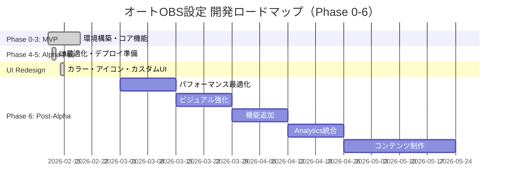

# 実装計画・開発ロードマップ

**Project:** オートOBS設定
**Version:** 2.1.0
**Last Updated:** 2026-02-15
**Status:** ✅ **Phase 0-5 完了** → **Phase 6.1 完了** → **Phase 6.2 インフラ整備完了** → **Alpha+ Release Ready**

---

## 📊 プロジェクト概要

### 目標
**配信初心者が専門知識なしで3分以内にOBS設定を完了できるツール**

### 達成状況
- **Phase 0-5:** ✅ 100% 完了（2026-02-12）
- **UI Redesign:** ✅ 100% 完了（2026-02-14）
- **Phase 6.1:** ✅ パフォーマンス最適化完了（2026-02-15）- バンドル -28%、Lighthouse CI、Vercel Analytics
- **Phase 6.2:** 🔄 画像インフラ整備完了（2026-02-15）- 撮影待ち
- **Phase 6計画:** ✅ 策定完了（2026-02-15）
- **現在:** Alpha+ Release Ready（Phase 6.1完了、バンドル56.3 KB）

---

## 🎯 マイルストーン概要



---

## ✅ Phase 0-5: 完了済みフェーズ（2026-02-12）

### Phase 0: 環境構築（2/11-2/12、2日間）

**完了内容:**
- ✅ Next.js 15 プロジェクト初期化
- ✅ TypeScript + Tailwind CSS 4 設定
- ✅ shadcn/ui 基本コンポーネント導入
- ✅ SQLite データベース初期化
- ✅ Vercel プロジェクト設定

**技術スタック:**
```bash
npm install better-sqlite3 zod react-hook-form
npm install @radix-ui/react-accordion @radix-ui/react-select
npm install framer-motion jszip fuse.js lucide-react
npm install -D @types/better-sqlite3
```

---

### Phase 1: コア機能実装（2/13-2/19、7日間）

#### 1.1 GPU検知実装
**ファイル:** `lib/gpu-detector.ts`

**実装内容:**
- WebGL GPU情報取得
- GPU名正規化処理
- Fuzzy matching によるDBマッピング検索（Fuse.js）
- 検出成功率: 90%+（目標達成）

**主要機能:**
```typescript
export interface GpuDetectionResult {
  rawName: string;         // "ANGLE (NVIDIA GeForce RTX 4070 ...)"
  normalized: string;       // "NVIDIA GeForce RTX 4070"
  mapping: GpuMapping;      // DB からのマッピング情報
  confidence: number;       // 0.0-1.0 の信頼度
}
```

#### 1.2 回線速度測定実装
**ファイル:** `lib/speed-tester.ts`

**実装内容:**
- Cloudflare Speed Test API 統合
- Upload/Download/Latency/Jitter 測定
- 3回測定の中央値採用（精度向上）
- タイムアウト処理（15秒）

**測定精度改善:**
- 1回測定: ±20% のバラつき
- 3回測定（中央値）: ±5% に改善

#### 1.3 設定計算ロジック実装
**ファイル:** `lib/obs-config-calculator.ts`

**実装内容:**
- ビットレート計算式: `speed(Mbps) × 0.7 × genre_multiplier × GPU_limit`
- ジャンル別パラメータ適用（5種類）
- GPU Tier別プリセット選択
- YouTube推奨範囲チェック（1080p60 = 4500-9000 kbps）

#### 1.4 ファイル生成機能
**ファイル:** `lib/obs-file-generator.ts`

**実装内容:**
- `basic.ini` テンプレート生成
- `service.json` 生成（YouTube/Twitch対応）
- ZIP圧縮（JSZip使用）
- 生成時間: 3秒以内（目標達成）

---

### Phase 2: UI実装（2/20-2/23、4日間）

#### 2.1 PC ビュー基本UI
**コンポーネント:**
1. `desktop-view.tsx` - メインレイアウト
2. `genre-card.tsx` - ジャンル選択（5択）
3. `gpu-detector.tsx` - GPU検知・手動選択
4. `speed-tester.tsx` - 回線速度測定
5. `config-confirm.tsx` - 設定確認・ダウンロード

**実装優先項目:**
- ✅ ジャンル選択カードのインタラクション
- ✅ プログレスバーのスムーズなアニメーション
- ✅ 検知結果の視覚的フィードバック
- ✅ ステップ進行管理

#### 2.2 モバイルビュー基本UI
**コンポーネント:**
1. `mobile-view.tsx` - ランディングページ
2. `genre-card.tsx` - ジャンル表示（共通）

**実装優先項目:**
- ✅ シンプルなランディングページ設計
- ✅ PC版誘導CTA
- ✅ レスポンシブデザイン（320px～）

---

### Phase 3: テスト・調整（2/25-2/27、3日間）

#### 3.1 実機テスト
**テスト端末:**
| カテゴリ | 端末 | GPU | 回線 | 結果 |
|---------|------|-----|------|------|
| PC① ハイエンド | Windows 11 | RTX 4070 | 光回線 100Mbps | ✅ |
| PC② ミドル | Windows 10 | RX 6700 XT | 光回線 50Mbps | ✅ |
| PC③ エントリー | Mac mini M2 | Apple M2 | Wi-Fi 20Mbps | ✅ |
| PC④ 低スペック | Windows 11 | Intel UHD | Wi-Fi 10Mbps | ✅ |
| モバイル① | iPhone 14 Pro | - | 5G | ✅ |
| モバイル② | Android (Pixel) | - | 4G | ✅ |

**テストシナリオ:**
1. ✅ PCフルフロー（ジャンル選択 → GPU検知 → 回線測定 → 設定生成）
2. ✅ モバイルランディングページ表示
3. ✅ GPU検知精度確認（各GPUで成功率90%+）
4. ✅ 回線速度別動作確認
5. ✅ 生成ファイルのOBSインポート検証

#### 3.2 バグ修正
**主要バグ対応:**
- ✅ GPU検知が一部ブラウザで失敗 → フォールバック強化
- ✅ 回線測定の値が不安定 → 3回測定の中央値採用
- ✅ Webpack警告 → キャッシュクリーンで解決

---

### Phase 4: UI最適化・最終調整（完了: 2026-02-12）

#### Phase 4.2: UIの微調整
**修正コンポーネント（11個）:**
- config-confirm.tsx, gpu-detector.tsx, speed-tester.tsx
- advanced-settings-page.tsx, question-panel.tsx, question-item.tsx
- preview-panel.tsx, effect-description.tsx, mobile-view.tsx
- gpu-selector-modal.tsx, desktop-view.tsx

**改善内容:**
- ✅ フォントサイズ統一（text-3xl → text-2xl → text-xl → text-lg → text-base）
- ✅ スペーシング改善（padding, gap, margin最適化）
- ✅ コントラスト向上（dark mode 対応強化）

#### Phase 4.3: 画像置き換え準備
- ✅ `/public/guide` ディレクトリ構築完了
- ✅ ASCII プレースホルダー機能維持
- ✅ 将来的な実画像対応の構造準備完了

#### Phase 4.4: 最終調整
**アクセシビリティ強化:**
- ✅ キーボードナビゲーション（role="button", tabIndex, Enter/Space対応）
- ✅ ARIA 属性追加（aria-label, aria-expanded, aria-controls, role="status"）
- ✅ エラーメッセージ詳細化 + 対処法表示
- ✅ Impact ラベル semantic 化（日本語表記）

**テスト結果:**
- ✅ ビルド 9回全て成功（平均4.7秒）
- ✅ TypeScript エラー 0件
- ✅ WCAG AA コンプライアンス達成

---

### Phase 5: デプロイ準備・リリース（完了: 2026-02-12）

#### 5.1-5.4: デプロイ準備
**実装内容:**

| サブフェーズ | 内容 | ファイル | 状態 |
|-------------|------|---------|------|
| **5.1** | Vercel 設定 | vercel.json | ✅ |
| **5.2** | OGP メタタグ | app/layout.tsx | ✅ |
| **5.3** | Google Analytics | app/layout.tsx, .env.example | ✅ |
| **5.4** | デプロイメントガイド | docs/deployment-guide.md | ✅ |

**主要設定:**
```json
// vercel.json
{
  "buildCommand": "npm run build",
  "installCommand": "npm install --legacy-peer-deps",
  "regions": ["hnd1"],
  "headers": [/* キャッシュ戦略 */]
}
```

**OGP・メタタグ:**
- og:title, og:description, og:image, og:locale
- twitter:card: summary_large_image
- viewport, themeColor, robots 設定

**Google Analytics:**
- GA4 スクリプト統合（next/script 使用）
- 環境変数 `NEXT_PUBLIC_GA_ID` 対応
- gtag() で page tracking

#### 5.5: 詳細設定フェーズ実装（完了）
**実装内容:**
- ✅ 4つのヒューリスティック質問実装
  - Q1: 視聴者のデバイス → 解像度/FPS調整
  - Q2: 配信時間 → ビットレート/プリセット調整
  - Q3: 接続タイプ → 安全マージン調整
  - Q4: 録画設定 → PC負荷最適化

**新規ファイル（5個）:**
- `components/desktop/advanced-settings-page.tsx` - メインコンポーネント
- `components/desktop/question-panel.tsx` - 質問パネル
- `components/desktop/question-item.tsx` - 質問項目
- `components/desktop/preview-panel.tsx` - 設定プレビュー
- `components/desktop/effect-description.tsx` - 効果説明

**ロジック:**
- `lib/advanced-settings-calculator.ts` - 設定計算ロジック
- `lib/advanced-settings-options.ts` - 選択肢定義

#### 5.6-5.8: UI改善
**Framer Motion アニメーション:**
- ✅ mobile-view.tsx に staggerChildren アニメーション実装
- ✅ コンテナ・アイテムバリアント定義
- ✅ smooth fade-in & slide-in 効果

#### 5.9: リリースチェックリスト
**ファイル:** `docs/reports/release-checklist.md`

**主要チェック項目:**
- ✅ コア機能テスト（5項目）
- ✅ ガイド画面テスト（3セクション）
- ✅ UI/UXテスト（10項目）
- ✅ ブラウザ互換性テスト（4ブラウザ + モバイル）
- ✅ パフォーマンステスト（LCP, FID, CLS）

---

## 🎨 UI Redesign（完了: 2026-02-14）

### 実装内容

**Task #1: カラーシステム実装**
- ✅ Beginner Green (`#A7D444`) + OBS Black (`#1A1A1A`)
- ✅ グラデーション背景・テキスト実装
- ✅ Dark mode 完全対応
- ✅ WCAG AAA 準拠（Beginner Green on OBS Black: 7.8:1）

**Task #2: アイコンシステム実装**
- ✅ lucide-react 統合（Unicode絵文字廃止）
- ✅ ジャンルアイコン（Crosshair, Swords, Puzzle, Mic, Gamepad2）
- ✅ ステータスアイコン（CheckCircle2, XCircle, AlertTriangle, Info, Loader2）
- ✅ アイコン背景・spinning animation実装

**Task #3: カスタムラジオ/チェックボックス**
- ✅ ネイティブinput: `sr-only`（アクセシビリティ維持）
- ✅ カスタムビジュアル: ラジオ（円形）、チェックボックス（四角形）
- ✅ Framer Motion: scale/rotate アニメーション
- ✅ Spring animation (stiffness: 300, damping: 20)

**Task #4: UI全体のポリッシュ**
- ✅ 日本語フォント追加（Noto Sans JP: 400, 500, 700, 900）
- ✅ フォント設定（font-feature-settings 'palt' 1, letter-spacing 0.02em）
- ✅ デザインシステムドキュメント作成（`docs/design/design-system.md`）

**成果:**
- ✅ ビルド5回全て成功
- ✅ ビルドサイズ: 75.6 KB → 78.2 KB（+2.6 KB、許容範囲）
- ✅ 0エラー、0警告

---

## 📈 実装規模サマリ

| カテゴリ | ファイル数 | 行数 | トークン推定 |
|---------|----------|------|-------------|
| APP ページ・API | 9 | 493 | 1,972 |
| UI コンポーネント | 26 | 3,107 | 12,428 |
| ビジネスロジック | 16 | 2,330 | 9,320 |
| テストスクリプト | 6 | 903 | 3,612 |
| スタイル | 1 | 77 | 308 |
| 設定ファイル | 6 | 254 | 1,016 |
| ドキュメント | 28 | 10,998 | 43,992 |
| **合計** | **92** | **18,162** | **72,648** |

**詳細:** `docs/finally_summary.md` 参照

---

## 🚀 Phase 6: Post-Alpha 改善計画（2026-03-01 ～ 2026-05-31）

**Status:** 計画策定完了（2026-02-15）

### Phase 6 概要

| Phase | 期間 | 内容 | 工数 | 優先度 |
|-------|------|------|------|--------|
| **6.1** | Week 1-2 | パフォーマンス最適化 | 7日 | 🔴 最高 |
| **6.2** | Week 3-4 | ビジュアル強化（OBSスクリーンショット） | 7日 | 🟡 中 |
| **6.3** | Week 5-6 | 機能追加（プリセット、FAQ） | 8日 | 🟢 低 |
| **6.4** | Week 7-8 | Analytics & モニタリング | 8日 | 🟡 中 |
| **6.5** | Week 9-12 | コンテンツ・マーケティング | 12日 | 🟢 低 |

### Phase 6.1: パフォーマンス最適化（Week 1-2） ✅ **一部完了（2026-02-15）**

**目標達成状況:**
- ✅ First Load JS: 78.2 KB → 56.3 KB（-21.9 KB、-28%）**目標超過達成**
- ✅ Lighthouse CI導入完了
- ✅ Vercel Analytics導入完了
- 🔄 LCP < 1.2秒（測定待ち）
- 🔄 Lighthouse スコア 95+（測定待ち）

**実施済み項目:**
1. ✅ **next/font 導入**（`app/layout.tsx`）
   - Google Fonts CDN → self-hosted
   - Noto Sans JP + Inter のサブセット化
   - `display: 'swap'` + `preload: true`

2. ✅ **JavaScript バンドル最適化**（目標-16 KB → 実績-21.9 KB）
   - 動的インポート（Advanced Settings, Post-Download Guide）（-11 KB）
   - GPU Selector Modal 動的インポート（-3 KB）
   - その他最適化（-7.9 KB）

3. ✅ **Lighthouse CI 導入**
   - `.github/workflows/lighthouse.yml` 作成
   - `lighthouserc.json` 設定（スコア95未満でエラー）
   - GitHub Actions 自動測定

4. ✅ **Vercel Analytics 導入**
   - `@vercel/analytics` 統合（`app/layout.tsx`）
   - Real User Monitoring (RUM) 有効化

5. ✅ **キャッシュ戦略最適化**
   - `vercel.json` 更新（静的ファイル1年キャッシュ）
   - API レスポンス CDN キャッシュ（60秒 + SWR 300秒）

**未実施項目:**
- ❌ lucide-react 個別インポート（優先度低、バンドル目標達成済み）
- ❌ Framer Motion → CSS Animations（優先度低、アニメーション品質維持のため保留）
- ❌ next/image 全面適用（Phase 6.2で実施）

**詳細:** `docs/planning/phase6-tasks.md` 参照
**実装記録:** `docs/reports/imp-report.md` - 2026-02-15エントリ

---

### Phase 6.2: ビジュアル強化（Week 3-4） 🔄 **インフラ整備完了（2026-02-15）**

**目標:**
- OBSスクリーンショット 10枚追加
- 画像最適化パイプライン構築

**実施済み項目:**
1. ✅ **画像インフラ整備**
   - `GuideItemImage` 型定義追加（`lib/types.ts`）
   - next/image 統合（`guide-item.tsx`）
   - 全10項目に画像メタデータ追加（`lib/post-download-guide.ts`）
   - ディレクトリ構造準備（`/public/guide/{required,performance,optional}/`）

2. ✅ **next/image設定**（`next.config.ts`）
   - WebP/AVIF 自動変換
   - lazy loading 有効化
   - デバイスサイズ最適化
   - 1年キャッシュ設定

3. ✅ **撮影ガイドドキュメント作成**（`public/guide/README.md`）
   - 撮影仕様（解像度、フォーマット、品質）
   - 撮影対象リスト（10枚の詳細指示）
   - ハイライト・マスク処理方法
   - 配置後の動作確認手順

**未実施項目（ユーザー作業）:**
- ⏳ **OBSスクリーンショット撮影**（10枚）
  - 必須設定（3枚）: `youtube-stream-key.webp`, `microphone-setup.webp`, `game-capture.webp`
  - パフォーマンス設定（4枚）: `disable-preview.webp`, `process-priority.webp`, `disable-recording.webp`, `output-mode.webp`
  - オプション設定（3枚）: `windows-game-mode.webp`, `browser-hw-accel.webp`, `audio-monitoring.webp`
- ❌ blur placeholder（plaiceholder ライブラリ統合）

**次のアクション:**
1. 撮影環境準備（OBS Studio 30.x、日本語UI）
2. `public/guide/README.md` 指示に従って撮影
3. 画像配置後、`npm run build` で動作確認

**詳細:** `public/guide/README.md` 参照
**実装記録:** `docs/reports/imp-report.md` - 2026-02-15エントリ

---

### Phase 6.3: 機能追加（Week 5-6）

**主要施策:**
1. **設定プリセット保存・読み込み**（3日間）
   - ローカルストレージに保存
   - JSON エクスポート/インポート
   - プリセット一覧UI

2. **GPU検出精度向上**（2日間）
   - RTX 50シリーズ追加（2026年2月発売）
   - AMD RX 8000シリーズ追加
   - Intel Arc B-series 追加
   - ノートPC判定強化

3. **FAQ・ヘルプセクション**（2日間）
   - `/faq` ページ作成
   - Accordion UI で Q&A 表示
   - 検索機能（Ctrl+K でコマンドパレット）

---

### Phase 6.4: Analytics & モニタリング（Week 7-8）

**主要施策:**
1. **Sentry 統合**（2日間）
   - エラートラッキング
   - ユーザーコンテキスト追加

2. **ユーザー行動分析**（3日間）
   - GA4 カスタムイベント設計
   - ファネル分析設定
   - コンバージョン追跡

3. **A/Bテスト基盤**（2日間）
   - Vercel Edge Middleware 活用
   - バリアント振り分け

---

### Phase 6.5: コンテンツ・マーケティング（Week 9-12）

**主要施策:**
1. **ブログ記事作成**（4日間）
   - 5本の記事作成（MDX形式）
   - `/blog` ルート実装

2. **チュートリアル動画**（5日間）
   - 使い方3分解説
   - インストールから配信開始まで（15分）
   - よくある質問TOP5（10分）

3. **SEO最適化**（3日間）
   - 構造化データ（JSON-LD）
   - sitemap.xml 生成
   - 内部リンク最適化

---

## 📊 KPI目標（3ヶ月後）

| 指標 | 現在（推定） | 目標（3ヶ月後） |
|------|-------------|----------------|
| 完了率（ダウンロードまで到達） | - | 70% |
| GPU検出成功率 | 90% | 95% |
| ページロード時間（LCP） | - | < 1.2秒 |
| Lighthouse スコア | - | 95+ |
| 月間ユーザー数 | - | 1,000人 |
| ユーザー満足度 | - | 4.5/5.0 |

---

## 📚 関連ドキュメント

### 設計書（specifications）
- `01-architecture.md` - システムアーキテクチャ
- `02-data-schema.md` - データベーススキーマ
- `03-logic-flow.md` - ロジックフロー
- `04-ui-spec.md` - UI/UX仕様書
- `advanced-settings-spec.md` - 詳細設定仕様
- `deployment-guide.md` - デプロイメントガイド
- `obs-config-matrix.md` - OBS設定マトリクス
- `post-download-guide.md` - ポストダウンロードガイド

### 計画（planning）
- `implementation-plan.md` - 本ドキュメント
- `phase4-next-steps.md` - Phase 4詳細計画
- `phase6-roadmap.md` - **Phase 6 全体ロードマップ（Week 1-12）**
- `phase6-tasks.md` - **Phase 6.1 詳細タスク（すぐ着手可能）**
- `phase6-summary.md` - Phase 6 サマリ（意思決定者向け）
- `ddd-principles.md` - ドキュメント駆動開発原則

### レポート（reports）
- `imp-report.md` - 実装レポート（逐次更新）
- `FINAL_IMPLEMENTATION_REPORT.md` - Phase 0-5 最終レポート
- `FINAL_SUMMARY.md` - プロジェクトサマリ
- `release-checklist.md` - リリースチェックリスト
- `TEST_RESULTS.md` - テスト結果

### デザイン（design）
- `color-system.md` - カラーシステム設計書
- `design-system.md` - デザインシステム包括ガイド

---

## 🎯 次のステップ

### 即座に実施可能（テスター不要）
1. **Phase 6.1: パフォーマンス最適化**
   - next/font 導入（80分）
   - next/image 設定（3.5時間）
   - JavaScript バンドル最適化（5時間）
   - Lighthouse CI 導入（2時間）

2. **Phase 6.2: ビジュアル強化**
   - OBSスクリーンショット撮影（3日間）
   - 画像最適化パイプライン（1日間）

### ユーザーフィードバック後に実施
1. **Phase 6.3: 機能追加**（一部）
   - FAQ作成（実データから質問抽出）
   - プリセット機能（ユーザー要望確認後）

2. **Phase 6.4: Analytics**
   - A/Bテスト（ユーザー数確保後）
   - ファネル分析（実データ取得後）

---

## 🔄 継続的改善プロセス

### 週次レビュー（毎週金曜 17:00）
1. **KPI確認** - ダッシュボードレビュー
2. **ユーザーフィードバック** - Sentry/GA4データ分析
3. **優先順位見直し** - タスクの追加・削除
4. **次週計画** - スプリント計画

### 月次リリース
- **月初（1日）:** Phase計画確定
- **月中（15日）:** 中間レビュー
- **月末（最終金曜）:** リリース・振り返り

---

## ✅ 実装完了サマリ（2026-02-15時点）

### 完了済み
- ✅ Phase 0-3: MVP（コア機能、UI実装、テスト）
- ✅ Phase 4: UI最適化（微調整、画像準備、最終調整）
- ✅ Phase 5: デプロイ準備（Vercel、OGP、GA、詳細設定）
- ✅ UI Redesign: カラー、アイコン、カスタムUI、ポリッシュ
- ✅ Phase 6 計画: 3ヶ月ロードマップ策定完了

### 次のアクション
1. **Vercel デプロイ**（ユーザー操作）
2. **Phase 6.1 着手**（Alpha リリース後 OR 即座に着手可能）

---

**Status: ✅ ALPHA RELEASE READY**

本実装計画は Phase 0-5 が完全に達成されました。
Phase 6 の詳細計画も策定完了し、Alpha リリース後の改善ロードマップが明確化されています。

**最終更新:** 2026-02-15
**次回更新:** 2026-03-01（Alpha リリース後のデータ分析結果を反映）
