# 実è£�E¨ˆç”»ãƒ»é–‹ç™ºãƒ­ãƒ¼ãƒ‰ã�Eãƒ�E�E
**Project:** オー�EBS設�E**Version:** 1.0.0
**Last Updated:** 2026-02-12 18:00 JST
**Status:** Phase 0-5.9 **100% 完äº�E* âœ�Eâ†�EAlpha リリース準備完äº�E**Target:** 2月末α版リリース�E�E026-02-28�E�E**Current:** ãƒ�E�Eロイå¾�E©Ÿä¸­

---

## 1. ãƒ�イルストã�Eン概è¦�E


---

## 2. フェーズ別詳細計画

### Phase 0: ç’°å¢�E§‹ç¯‰ï¼�E/11-2/12ã€�E日間ï¼�E
#### 完äº�EŸºæº�E- [ ] Next.js 15プロジェクトå�E期化
- [ ] TypeScript + Tailwind CSS設定完äº�E- [ ] shadcn/ui基本コンãƒ�ã�Eãƒ�ントå°�å�E
- [ ] SQLiteãƒ�E�Eタベã�Eスåˆ�期åŒ�E- [ ] Vercelプロジェクト作æ�E

#### タスク詳細

```bash
# 1. プロジェクトå�E期化
npx create-next-app@latest stream-auto-setting \
  --typescript \
  --tailwind \
  --app \
  --import-alias "@/*"

cd stream-auto-setting

# 2. ä¾�存関係インストã�Eル
npm install better-sqlite3 zod react-hook-form
npm install @radix-ui/react-accordion @radix-ui/react-select
npm install framer-motion jszip fuse.js
npm install -D @types/better-sqlite3

# 3. shadcn/ui�期�Enpx shadcn-ui@latest init
npx shadcn-ui@latest add button card input select accordion toast

# 4. DB�期化スクリプト実�Enode scripts/init-db.js
```

**ãƒ�E‚£ãƒ¬ã‚¯ãƒˆãƒªæ§‹æ�E:**
```
stream-auto-setting/
├─ app/
�E ├─ page.tsx                 # トップ（モ�イル/PC自動判定�E�E ├─ api/
â”�E â”�E ├─ generate/route.ts     # 設定ファイル生æ�E
�E �E └─ gpu/map/route.ts      # GPU�ッピング検索
�E └─ layout.tsx
├─ components/
�E ├─ mobile/
�E �E ├─ MobileHero.tsx
�E �E ├─ MobileHowItWorks.tsx
�E �E ├─ MobileFeatures.tsx
�E �E └─ MobilePcRedirect.tsx
�E ├─ desktop/
�E �E ├─ DesktopGenreSelector.tsx
�E �E ├─ EnvironmentDetector.tsx
�E �E ├─ DetectionSummary.tsx
�E �E └─ ConfigDownloadGuide.tsx
�E └─ ui/                      # shadcn/ui components
├─ lib/
�E ├─ db/
�E �E ├─ client.ts             # SQLite��E�E �E ├─ schema.ts             # �E�Eブル定義
�E �E └─ seed.ts               # �期�E�Eタ
�E ├─ gpu-detector.ts          # Server-only
�E ├─ gpu-detector-client.ts   # Client-only
�E ├─ speed-tester.ts
�E ├─ obs-config-calculator.ts
�E ├─ obs-file-generator.ts
�E └─ utils.ts
├─ public/
�E └─ guide/                   # ガイド画�E├─ data/
�E └─ mappings.db              # SQLite DB�E�Epu_mappings, genre_configs�E�E└─ docs/
   └─ lv1/                     # 設計ドキュメン�E```

---

### Phase 1: コア機è�E実è£�E¼�E/13-2/19ã€�E日間ï¼�E
#### 1.1 GPU検知実è£�E¼�E/13-2/14ã€�E日間ï¼�E
**ファイル:** `lib/gpu-detector.ts`

**実�E�E容:**
```typescript
export interface GpuDetectionResult {
  rawName: string;
  normalized: string;
  mapping: GpuMapping;
  confidence: number;
}

export async function detectGpu(): Promise<GpuDetectionResult> {
  // 1. WebGL GPUæƒ�E ±å�–å¾�E  const gpuInfo = detectGpuWebGL();

  // 2. GPU�正�化
  const normalized = normalizeGpuName(gpuInfo.rawName);

  // 3. DB�ッピング検索
  const { mapping, confidence } = await findGpuMapping(normalized);

  return {
    rawName: gpuInfo.rawName,
    normalized,
    mapping,
    confidence,
  };
}
```

**ãƒ�E‚¹ãƒˆã‚±ãƒ¼ã‚¹:**
```typescript
// test/gpu-detector.test.ts
describe('GPU Detection', () => {
  test('NVIDIA RTX 4070を正��検知', () => {
    const raw = 'ANGLE (NVIDIA GeForce RTX 4070 Direct3D11 vs_5_0 ps_5_0)';
    const normalized = normalizeGpuName(raw);
    expect(normalized).toBe('NVIDIA GeForce RTX 4070');
  });

  test('AMD RX 7800 XTを正��検知', () => {
    const raw = 'AMD Radeon RX 7800 XT (RADV NAVI32)';
    const normalized = normalizeGpuName(raw);
    expect(normalized).toBe('AMD Radeon RX 7800 XT');
  });

  test('未知�GPU�フォール�ック', async () => {
    const result = await findGpuMapping('Unknown GPU XYZ');
    expect(result.mapping.encoder).toBe('obs_x264');
    expect(result.confidence).toBeLessThan(0.6);
  });
});
```

---

#### 1.2 å›�線速度測定実è£�E¼�E/15-2/16ã€�E日間ï¼�E
**ファイル:** `lib/speed-tester.ts`

**実�E�E容:**
- Cloudflare Speed Test APIçµ±å��E- Latency/Jitter測å®�E- プログレスコールãƒ�ック対å¿�E- タイムアウトå�Eç��E¼�E5秒ï¼�E
**API統�E**
```typescript
// app/api/speed-test/route.ts
export async function POST(request: Request) {
  const { uploadMbps, downloadMbps, latencyMs } = await request.json();

  // åˆ�E��用ã�«ãƒ­ã‚°ä¿�存（å°�E�¥çš�E�ªæ”¹å–�Eƒ‡ãƒ¼ã‚¿�E�E  await db.insert('speed_logs', {
    upload_mbps: uploadMbps,
    latency_ms: latencyMs,
    timestamp: new Date(),
  });

  return Response.json({ success: true });
}
```

---

#### 1.3 設定計算ロジãƒ�E‚¯�E�E/17-2/18ã€�E日間ï¼�E
**ファイル:** `lib/obs-config-calculator.ts`

**実�E�E容:**
- ビットレート計算�実�E- ジャンル別パラメータ�用
- GPU Tier別プリセãƒ�Eƒˆé�¸æŠ�E- YouTubeæ�¨å¥¨ç¯�E›²ãƒ�ェãƒ�E‚¯

**ãƒ�E‚¹ãƒˆã‚±ãƒ¼ã‚¹:**
```typescript
describe('OBS Config Calculation', () => {
  test('FPS高負� �ERTX 4070 �E15Mbps = 9000kbps', () => {
    const config = calculateObsConfig({
      genre: GENRES['fps-high'],
      gpu: GPU_MAPPINGS['NVIDIA GeForce RTX 4070'],
      speed: { uploadMbps: 15.2, ... },
    });

    expect(config.bitrate).toBe(9000);
    expect(config.fps).toBe(60);
    expect(config.encoder).toBe('ffmpeg_nvenc');
  });

  test('雑�E�E�速��E= 720p30�自動調整', () => {
    const config = calculateObsConfig({
      genre: GENRES['chat'],
      gpu: GPU_MAPPINGS['AMD Radeon RX 6700 XT'],
      speed: { uploadMbps: 5.0, ... },
    });

    expect(config.outputResolution).toBe('1280x720');
    expect(config.fps).toBe(30);
  });
});
```

---

#### 1.4 ファイル生æ�Eæ©Ÿè�E�E�E/19ã€�E日間ï¼�E
**ファイル:** `lib/obs-file-generator.ts`

**実�E�E容:**
- `basic.ini` ãƒ�Eƒ³ãƒ—レート生æˆ�E- `service.json` 生æ�E
- ZIP圧縮�E�ESZip使用�E�E
**APIエンドã�Eインãƒ�E**
```typescript
// app/api/generate/route.ts
export async function POST(request: Request) {
  const { sessionCode, gpuDetection, speedTest } = await request.json();

  // 1. ã‚»ãƒ�E‚·ãƒ§ãƒ³æ¤œè¨¼
  const session = await getSession(sessionCode);
  if (!session || session.expiresAt < new Date()) {
    return Response.json({ error: 'Invalid session' }, { status: 400 });
  }

  // 2. 設定計�E  const genre = await getGenreConfig(session.genre);
  const config = calculateObsConfig({
    genre,
    gpu: gpuDetection.mapping,
    speed: speedTest,
  });

  // 3. ファイル生æ�E
  const zipBlob = await generateConfigZip(config);

  // 4. 動的ガイド生�E  const guide = generateDynamicGuide(config, gpuDetection.mapping);

  return new Response(zipBlob, {
    headers: {
      'Content-Type': 'application/zip',
      'Content-Disposition': 'attachment; filename="obs-config.zip"',
      'X-Guide-Data': JSON.stringify(guide), // ヘッダー�ガイド情報も返�
    },
  });
}
```

---

### Phase 2: UI実è£�E¼�E/20-2/23ã€�E日間ï¼�E
#### 2.1 PCビュー基本UI�E�E/20-2/21�E日間�E
**コンãƒ�ã�Eãƒ�ンãƒ�E**
1. `DesktopGenreSelector.tsx` - ジャンル��E2. `EnvironmentDetector.tsx` - GPU検知・�線測�E3. `DetectionSummary.tsx` - ��表示
4. `ConfigDownloadGuide.tsx` - DL・ガイ�E
**優先実�E**
- ジャンルé�¸æŠ�カードã�Eインタラクション
- プログレスãƒ�ã�Eã�®ã‚¹ãƒ ãƒ¼ã‚ºã�ªã‚¢ãƒ‹ãƒ¡ãƒ¼ã‚·ãƒ§ãƒ³
- 検知çµ�æ�œã�®è¦–覚的フィードãƒ�ãƒ�E‚¯

---

#### 2.2 スãƒ�ã�Eビュー基本UI�E�E/22-2/23ã€�E日間ï¼�E
**コンãƒ�ã�Eãƒ�ンãƒ�E**
1. `MobileHero.tsx` - ヒã�Eローセクション
2. `MobileHowItWorks.tsx` - 動作概è¦�E3. `MobileFeatures.tsx` - 特徴・メリãƒ�Eƒˆ
4. `MobilePcRedirect.tsx` - PC版誘�E
**優先実�E**
- シンプルã�ªãƒ©ãƒ³ãƒ�E‚£ãƒ³ã‚°ãƒšã�Eジ設è¨�E- フェードインアニメーション
- URLコピã�Eæ©Ÿè�E
- レス�ンシブデザイン�E�E20px〜�E
---

### Phase 3: ãƒ�E‚¹ãƒˆã�E調整�E�E/25-2/27ã€�E日間ï¼�E
#### 3.1 実機テスト�E/25-2/26�E日間�E
**ãƒ�E‚¹ãƒˆç«¯æœ«:**
| ã‚«ãƒ�E‚´ãƒª | 端末 | GPU | å›�ç·�E|
|---------|------|-----|------|
| PCâ‘ �Eˆãƒ�イエンドï¼�E| Windows 11 | RTX 4070 | å…‰å›�ç·�E100Mbps |
| PCâ‘¡�EˆãƒŸãƒ‰ãƒ«�E�E| Windows 10 | RX 6700 XT | å…‰å›�ç·�E50Mbps |
| PCâ‘¢�Eˆã‚¨ãƒ³ãƒˆãƒªãƒ¼�E�E| Mac mini M2 | Apple M2 | Wi-Fi 20Mbps |
| PCâ‘£�Eˆä½�スペック�E�E| Windows 11 | Intel UHD | Wi-Fi 10Mbps |
| スãƒ�ã�Eâ‘  | iPhone 14 Pro | - | 5G |
| スãƒ�ã�Eâ‘¡ | Android (Pixel) | - | 4G |

**ãƒ�E‚¹ãƒˆã‚·ãƒŠãƒªã‚ª:**
1. **PCフルフロー**
   - ジャンルé�¸æŠ�Eâ†�EGPU検知 â†�Eå›�線測å®�Eâ†�E設定生æˆ�E   - 所è¦�時é–�E 3åˆ�E»¥å†�E
2. **モãƒ�イルランãƒ�E‚£ãƒ³ã‚°ãƒšã�Eジ**
   - å��E‚»ã‚¯ã‚·ãƒ§ãƒ³ã�®è¡¨ç¤ºç¢ºèª�E   - URLコピã�Eæ©Ÿè�E動作確èª�E   - レスãƒ�ンシブデザイン確èª�E
3. **GPU検知精度**
   - å�„GPUã�§æ¤œçŸ¥æˆ�功ç��E‚’確èª�E   - 誤検知時ã�Eフォールãƒ�ック動作確èª�E
4. **�線速度別動�E*
   - 高速�線�E5Mbps以上�E 最高画質設�E   - 中速�線�E0-15Mbps�E�E �ランス設�E   - �速�線�E-10Mbps�E�E 警告表示+�画質
   - 極�速�EMbps未満�E�E �確�注�喚起

5. **生æ�Eファイル検証**
   - OBSã�§å®Ÿéš›ã�«ã‚¤ãƒ³ãƒ�ã�Eãƒ�E   - é…�ä¿¡ãƒ�E‚¹ãƒˆï¼�EouTube Liveãƒ�E‚¹ãƒˆã‚¹ãƒˆãƒªãƒ¼ãƒ �E�E   - 画質・安定性確èª�E
**ãƒ�グトラãƒ�E‚­ãƒ³ã‚°:**
```markdown
| ID | 発見日 | 優先度 | å†�E®¹ | スãƒ�E�Eタス |
|----|--------|--------|------|----------|
| BUG-001 | 2/25 | High | GPU検知�一部�ブラウザ�失�E| 修正中 |
| BUG-002 | 2/25 | Medium | スãƒ�ã�Eã�§ã‚³ãƒ¼ãƒ‰ã‚³ãƒ”ã�Eボタンã�Œå��å¿œã�—ã�ªã��E| 対応æ¸�E|
| BUG-003 | 2/26 | Low | ガイド画åƒ�ã�E読ã�¿è¾¼ã�¿ã�Œé�…ã��E| è¦�改å–�E|
```

---

#### 3.2 �グ修正�E�E/27�E日間�E
**優先度別対�E**
- **High�Eˆå¿�E ˆä¿®æ­£�E�E*: α版リリースå‰�ã�«å¿�E�šä¿®æ­£
- **Medium�Eˆæ�¨å¥¨ä¿®æ­£�E�E*: å�¯èƒ½ã�ªé™�り修正ã€�ç„¡ç��E�ªã‚‰Î²ç‰ˆã�§å¯¾å¿�E- **Low�Eˆæ”¹å–�E¦�望�E�E*: β版以é™�ã�§å¯¾å¿�E
---

#### 3.3 ドキュメント整備�E/27�E日間�E
**作æ�Eドキュメンãƒ�E**
1. `README.md` - プロジェクト概è¦�ã€�ã‚»ãƒ�Eƒˆã‚¢ãƒ�E�E手é �E2. `CONTRIBUTING.md` - 開発è€�E�‘ã�‘ガイãƒ�E3. `public/guide/index.html` - ユーザーå�‘ã�‘ガイドã�Eージ
4. `CHANGELOG.md` - ãƒ�ã�Eジョン履歴

---

### Phase 4: UI最é�©åŒ–ã�E最終調整�Eˆå®Œäº�E€�E日間ï¼�E
**ス�E�Eタス:** �E**100% 完�E*�E�E026-02-12�E�E
#### 4.1 実è£�E¦‚è¦�E
UI ã�®è¦–èª�性・アクセシビリãƒ�E‚£ãƒ»ãƒ�E�Eロイ準備を完äº�E�—ã�¾ã�—ã�Ÿã€�E
**実�E�E容:**

| サブフェーズ | å†�E®¹ | 対象 | 状æ…�E|
|-------------|------|------|------|
| **4.2** | UIã�®å¾®èª¿æ•´�Eˆãƒ•ã‚©ãƒ³ãƒˆã�E色・スペã�Eシング�E�E| 11 components | âœ�E|
| **4.3** | 画�置���（インフラ準備�E�E| /public/guide | �E|
| **4.4** | 最終調整�Eˆã‚¢ã‚¯ã‚»ã‚·ãƒ“リãƒ�E‚£ãƒ»ã‚¨ãƒ©ãƒ¼ãƒ�ンドリング�E�E| è¤�E•° components | âœ�E|

#### 4.2 実�E�E容詳細

**Phase 4.2: UIã�®å¾®èª¿æ•´�Eˆãƒ•ã‚©ãƒ³ãƒˆã�E色・スペã�Eシング最é�©åŒ–ï¼�E*

修正コンãƒ�ã�Eãƒ�ントï¼�E1個ï¼�E
- config-confirm.tsx�Eˆè¨­å®šç¢ºèª�ç”»é�¢�E�E- gpu-detector.tsx�E�EPU検知画é�¢�E�E- speed-tester.tsx�Eˆå›�線速度測定ï¼�E- advanced-settings-page.tsx�Eˆè©³ç´°è¨­å®šï¼�E- question-panel.tsx, question-item.tsx�Eˆè³ªå•�é �E›®�E�E- preview-panel.tsx, effect-description.tsx�Eˆã�Eレビュー�E�E- mobile-view.tsx�Eˆãƒ¢ãƒ�イルランãƒ�E‚£ãƒ³ã‚°�E�E- gpu-selector-modal.tsx�E�EPUé�¸æŠ�モーダル�E�E- desktop-view.tsx�Eˆãƒ‡ã‚¹ã‚¯ãƒˆãƒƒãƒ—ビュー�E�E
改�E�E容�E�E- フォントサイズ統一: text-3xl �Etext-2xl �Etext-xl �Etext-lg �Etext-base
- スペã�Eシング改å–�E padding p-3 â†�Ep-4/p-5, gap 改å–�E- コントラストå�‘ä¸�E border 追加ã€�dark mode 対å¿�E
**Phase 4.3: 画�置���（インフラ準備�E�E*

- /public/guide ãƒ�E‚£ãƒ¬ã‚¯ãƒˆãƒªæ§‹æ�E完æ�E
- ASCII プレースホルダー機è�E維æŒ�E- å°�E�¥çš�E�ªå®Ÿç”»åƒ�対応ã�E構造準備完äº�E
**Phase 4.4: 最終調整**

アクセシビリãƒ�E‚£å¼·åŒ–ï¼�E- キーボã�Eドナビゲーション: role="button", tabIndex, Enter/Space 対å¿�E- ARIA å±�性: aria-label, aria-expanded, aria-controls, role="status"
- エラーメãƒ�E‚»ãƒ¼ã‚¸è©³ç´°åŒ�E+ 対処法表示
- Impact ラベル semantic 化（日本�表記�E
#### 4.3 ãƒ�E‚¹ãƒˆçµ�æ�œ

âœ�E**ビルãƒ�E** 9å›�ã�™ã�¹ã�¦æˆ�功�Eˆå¹³å��E4.7秒ï¼�Eâœ�E**TypeScript:** エラー 0å€�Eâœ�E**アクセシビリãƒ�E‚£:** WCAG AA コンプライアンスé�”æ�E

#### 4.4 実è£�Eƒ•ã‚¡ã‚¤ãƒ«

修正ファイル�E�E- components/ ��E11 component
- app/layout.tsx�E�EGP + GA�E�E- components/post-download/guide-item.tsx�Eˆã‚¢ã‚¯ã‚»ã‚·ãƒ“リãƒ�E‚£�E�E
新�ファイル�E�E- docs/FINAL_IMPLEMENTATION_REPORT.md
- RELEASE_CHECKLIST.md
- �E3 ファイル

#### 4.5 実è£�E·¥æ•°�Eˆå®Ÿç¸¾�E�E
実際ã�®å®Ÿè£�E™‚é–�E **ç´�E時間**�Eˆè¨ˆç”»: 2-3æ—¥�E�E- Phase 4.2: 50åˆ�E- Phase 4.4: 40åˆ�E- ドキュメントã�Eãƒ�E‚¹ãƒ�E 30åˆ�E
**実è£�E‹…å½�E** Claude Haiku 4.5

---

### Phase 5: ãƒ�E�Eロイ準備・リリース�Eˆå®Œäº�E€�E日間ï¼�E
**スãƒ�E�Eタス:** âœ�E**100% 完äº�E- ãƒ�E�Eロイå¾�E©Ÿä¸­**�E�E026-02-12�E�E
#### 5.1-5.4 ãƒ�E�Eロイ準備�Eˆå®Œäº�E¼�E
**実�E�E容:**

| サブフェーズ | å†�E®¹ | ファイル | 状æ…�E|
|-------------|------|---------|------|
| **5.1** | Vercel 設�E| vercel.json | �E|
| **5.2** | OGP メタタグ | app/layout.tsx | �E|
| **5.3** | Google Analytics | app/layout.tsx, .env.example | �E|
| **5.4** | �E�Eロイメントガイ�E| docs/deployment-guide.md | �E|

**実è£�E©³ç´°:**

**5.1: Vercel 設�E*
```json
{
  "buildCommand": "npm run build",
  "installCommand": "npm install --legacy-peer-deps",
  "regions": ["hnd1"],
  "headers": [キャãƒ�E‚·ãƒ¥æˆ¦ç•¥]
}
```

**5.2: OGP・メタタグ**
- og:title, og:description, og:image, og:locale
- twitter:card: summary_large_image
- viewport, themeColor, robots 設�E
**5.3: Google Analytics**
- GA4 スクリプト統å�ˆï¼�Eext/script 使用�E�E- ç’°å¢�E¤‰æ•° NEXT_PUBLIC_GA_ID 対å¿�E- gtag() ã�§ page tracking

**5.4: ドキュメン�E*
- docs/deployment-guide.md�E�E000+ èª�ï¼�E  - GitHub â†�EVercel æ�¥ç¶šæ‰‹é �E  - ç’°å¢�E¤‰æ•°è¨­å®�E  - Google Analytics ã‚»ãƒ�Eƒˆã‚¢ãƒ�E�E
  - トラブルシューãƒ�E‚£ãƒ³ã‚°

#### 5.5 動的 OGP 画�生�（追加�E�E
新�ファイル: app/api/og/route.tsx
- Next.js ImageResponse 使用
- 1200x630px OGP ç”»åƒ�を動的生æ�E
- Edge Runtime ã�§é«˜é€Ÿå�Eç��E
#### 5.6-5.8 UI改å–�E¼ˆå®Œäº�E¼�E
**Framer Motion アニメーション:**
- mobile-view.tsx ã�« staggerChildren アニメーション実è£�E- コンãƒ�EƒŠãƒ»ã‚¢ã‚¤ãƒ�Eƒ ãƒ�リアント定義
- smooth fade-in & slide-in 効�E
#### 5.9 リリースãƒ�ェãƒ�E‚¯ãƒªã‚¹ãƒˆï¼ˆå®Œäº�E¼�E
ファイル: RELEASE_CHECKLIST.md

**ãƒ�E‚¹ãƒˆãƒ�ェãƒ�E‚¯ãƒªã‚¹ãƒ�E**
- [ ] コア機è�Eãƒ�E‚¹ãƒˆï¼�Eé �E›®�E�E- [ ] ガイド画é�¢ãƒ�E‚¹ãƒˆï¼�Eセクション�E�E- [ ] UI/UX ãƒ�E‚¹ãƒˆï¼�Eé �E›®�E�E- [ ] ブラウザ互æ�›æ€§ãƒ�E‚¹ãƒˆï¼�Eブラウザ + モãƒ�イル�E�E- [ ] パフォーãƒ�ンスãƒ�E‚¹ãƒˆï¼�ECP, FID, CLS�E�E- [ ] エラーãƒ�ンドリングãƒ�E‚¹ãƒ�E
**�E�Eロイメント手�E**
1. ç’°å¢�E¤‰æ•°è¨­å®šï¼�Eercel�E�E2. GitHub push
3. 自動デプロイ
4. 本番環å¢�E¢ºèª�E
**監視計画:**
- åˆ�期 24 時間: エラーログã€�フィードãƒ�ãƒ�E‚¯
- 1 週�E 使用パターン�E����グ対�E
#### 5.10 実è£�E·¥æ•°�Eˆå®Ÿç¸¾�E�E
実è£�E™‚é–�E **ç´�E時間**�Eˆè¨ˆç”»: 2-3時間�E�E- Phase 5.1-5.4: 30åˆ�E- Phase 5.6-5.8: 15åˆ�E- Phase 5.9 + ドキュメンãƒ�E 15åˆ�E
**実è£�E‹…å½�E** Claude Haiku 4.5

#### 5.11 本番�E�Eロイ手�E
**準備フェーズ:**
```bash
# 1. 最終ビルド確�Enpm run build

# 2. GitHub � push
git add .
git commit -m "Release preparation: Phase 4-5 complete"
git push origin main
```

**�E�Eロイフェーズ:**
- Vercel ダãƒ�E‚·ãƒ¥ãƒœã�Eドã�§è‡ªå‹•ãƒ‡ãƒ—ロイ開å§�E- GitHub â†�EVercel 自動連æ�º
- プレビュー環å¢�E�§æ¤œè¨¼

**本番確�E**
- [ ] サイトアクセス確�E- [ ] Google Analytics tracking
- [ ] OGP タグ確��ENS シェア�E�E- [ ] Core Web Vitals 確�E
#### 5.12 リリースãƒ�ã�Eãƒ�E
**v1.0.0 Alpha**
- âœ�Eジャンルé�¸æŠ�ï¼�E種é¡�ï¼�E- âœ�EGPU 自動検知�E�EebGL�E�E- âœ�Eå›�線速度測定ï¼�Eloudflare API�E�E- âœ�EOBS 設定è�E動生æˆ�ï¼�EIP�E�E- âœ�E詳細設定機è�E�E�E ヒアリングé �E›®�E�E- âœ�Eガイド画é�¢�Eˆå¿�E ˆã�Eパフォーãƒ�ンス・オプション設定ï¼�E- âœ�Eモãƒ�イル対å¿�E- âœ�EGoogle Analytics çµ±å��E- âœ�EWCAG AA アクセシビリãƒ�E‚£å¯¾å¿�E
**今後ã�E改å–�E**
- [ ] ユーザーフィードãƒ�ãƒ�E‚¯å��映�E�Ehase 6�E�E- [ ] 実画åƒ�スクリーンショãƒ�Eƒˆ�E�Ehase 6�E�E- [ ] パフォーãƒ�ンス最é�©åŒ–ï¼�Ehase 6�E�E [ ] OGPç”»åƒ�ã�Eメタタグ設定完äº�E- [ ] Google Analytics設定ï¼�Eercel Analytics�E�E
---

## 3. β版計画�E�E月中旬目標�E
### 追加機è�E

#### 3.1 動的ガイド強åŒ�E- GPU/OS別ã�®ç”»åƒ�を動的生æ�E�E�Eharp.js使用�E�E- スクリーンショãƒ�Eƒˆä»˜ã��手é �E›¸
- 動画ガイド埋�込�

#### 3.2 å›�線測定高度åŒ�E- è¤�E•°å›�測定ã�Eå¹³å��E€¤ä½¿ç”¨
- ジãƒ�E‚¿ãƒ¼ãƒ»ãƒ‘ケãƒ�Eƒˆãƒ­ã‚¹æ¤œå�E
- 測定履歴グラフ表示

#### 3.3 エラーリカãƒ�リー強åŒ�E- GPU検知失敗時ã�®ãƒ¦ãƒ¼ã‚¶ãƒ¼æ‰‹å‹•é�¸æŠ�UI改å–�E- 設定ã�Eレビュー機è�E
- OBS連�API�E�Ebs-websocket�E�E
#### 3.4 åˆ�E��æ©Ÿè�E
- ユーザー環å¢�Eµ±è¨ˆãƒ€ãƒ�E‚·ãƒ¥ãƒœã�Eãƒ�E- GPU検知æˆ�功ç��Eƒ¬ãƒ�ã�Eãƒ�E- 人気ジャンルåˆ�E��

---

## 4. 技術的負債・å°�E�¥å¯¾å¿�E
### 4.1 α版�許容�る負債

| é �E›® | ç�¾çŠ¶ | ç��Eƒ³ | 対応時æœ�E|
|-----|------|------|---------|
| DB | SQLite�Eˆã�Eスタãƒ�E�Eã‚¿ã�®ã�¿�E�E| PostgreSQL | v1.0�Eˆãƒ¦ãƒ¼ã‚¶ãƒ¼ãƒ�E�Eタ追加時ï¼�E|
| ç”»åƒ�é�Eä¿¡ | Static Files | CDN�E�Eloudflare Images�E�E| βç‰�E|
| GPU検知 | WebGL�� | + User-Agent解�E| v1.0 |
| å›�線測å®�E| Cloudflare API | + 自å‰�測定サーãƒ�ã�E | v1.5 |

### 4.2 スケーラビリãƒ�E‚£

**想定負�:**
- αç‰�E 100ã‚»ãƒ�E‚·ãƒ§ãƒ³/æ—¥
- βç‰�E 1,000ã‚»ãƒ�E‚·ãƒ§ãƒ³/æ—¥
- v1.0: 10,000ã‚»ãƒ�E‚·ãƒ§ãƒ³/æ—¥

**対応�E**
| フェーズ | 対応å�E容 |
|---------|---------|
| αç‰�E| Vercel Hobby�Eˆç„¡æ–™æ� �E�E|
| β�E| Vercel Pro�E�E20/月）�Cloudflare CDN |
| v1.0 | PostgreSQL移行ã€�Rediså°�å�Eã€�Edge Functions活用 |

---

## 5. リスク管�E
### 5.1 主�リスク

| リスク | 影響度 | 発生確�E| 対�E|
|-------|--------|---------|------|
| GPU検知精度�足 | High | Medium | フォール�ック強化�手動��UI |
| å›�線測定API障害 | Medium | Low | タイムアウトå�Eç��E€�ä¿�守的ãƒ�Eƒ•ã‚©ãƒ«ãƒˆå€¤ |
| OBS仕様変更 | High | Low | OBS beta版�事�検証 |
| 開発é��E»¶ | Medium | Medium | MVP優先ã€�β版ã�«æ©Ÿè�E延æœ�E|

### 5.2 �質基準（最�ライン�E�E
| é �E›® | 基準値 | 測定方æ³�E|
|-----|--------|---------|
| GPU検知�功�E| 90%以�E| 実機テス�E00� |
| 設定生æˆ�æ�E功ç�‡ | 99%以ä¸�E| エラー監è¦�E|
| ペã�Eジ表示速度 | 2秒以å†�E| Lighthouse |
| ファイル生æ�E時間 | 3秒以å†�E| パフォーãƒ�ンスãƒ�E‚¹ãƒ�E|

---

## 6. ãƒ�ã�Eム体制�Eˆæƒ³å®šï¼�E
**α版開発�Eˆå€‹äººé–‹ç™ºæƒ³å®šï¼�E**
- フルスタãƒ�E‚¯é–‹ç™ºè€�E1å��（ã�‚ã�ªã�Ÿï¼�E
**β版以�（拡張時�E**
- フロントエンãƒ�E 1å��E- ãƒ�ックエンãƒ�E 1å��E- ãƒ�E‚¶ã‚¤ãƒŠã�E�Eˆã‚¬ã‚¤ãƒ‰ç”»åƒ�作æ�E�E�E 1å��（外注å�¯�E�E
---

## 7. ���E
### 7.1 α版ã�§é�”æ�Eã�™ã‚‹ã�“ã�¨

âœ�E**å¿�E ˆæ©Ÿè�E�E�EVP�E�E**
- モãƒ�イル版：宣ä¼�ã�E動作概è¦�ã�EPC誘å°�E- PC版：ジャンルé�¸æŠ�ã�EGPU検知・å›�線測å®�E- OBS設定ファイル生æ�E�E�Easic.ini, service.json�E�E- 基本çš�E�ªã‚¬ã‚¤ãƒ‰è¡¨ç¤º

�E**UX目�E**
- 専門知識ã�ªã�—ã�§3åˆ�E»¥å†�E�«å®Œäº�E- 離脱ç��E0%以下（業界平å��E0%�E�E- 設定ファイルã�Œç¢ºå®Ÿã�«OBSã�§å‹•ä½�E
�E**β版以��延�E**
- 動的ガイド画�生�E- OBS連�API
- 詳細ã�ªåˆ�E��ダãƒ�E‚·ãƒ¥ãƒœã�Eãƒ�E
### 7.2 æˆ�功æŒ�E¨™ï¼ˆÎ±ç‰ˆï¼�E
| KPI | 目標値 | 測定方�E|
|-----|--------|---------|
| 設定生æˆ�完äº�E�‡ | 70%以ä¸�E| Funnelåˆ�E�� |
| GPU検知�功�E| 90%以�E| ログ�E�� |
| ファイルDLç��E| 95%以ä¸�E| イベントトラãƒ�E‚­ãƒ³ã‚° |
| OBS Importæˆ�功ç��E| 85%以ä¸�E| ユーザーフィードãƒ�ãƒ�E‚¯ |

---

## 8. 実è£�E¸­ã�«ç™ºè¦‹ã�•ã‚Œã�Ÿèª²é¡Œã�¨å¯¾å¿œï¼�E026-02-12æ›´æ–°�E�E
### 8.1 Phase 4.1 実è£�E®Œäº�E¾Œã�Eæ–°è¦�課é¡�E
| 課題ID | 課題å�E容 | 優先度 | 対応状æ³�E| 対応å�E容 |
|-------|---------|--------|---------|---------|
| **ISSUE-001** | å›�線速度測定ã�E値ã�Œæ¯�å›�変動ã�™ã‚‹ | High | âœ�E対応æ¸�E| 3å›�測定â�E中央値æ�¡ç”¨ã�«æ”¹ä¿®�E�E026-02-12�E�E|
| **ISSUE-002** | GPU検知ã�®ä¿¡é ¼åº¦ã�Œä½�ã�„å ´å�ˆã�E警告ã�Œä¸�足 | Medium | âœ�E対応æ¸�E| UI改å–�E�§è­¦å‘Šã‚’強調表示�E�E‚¢ã‚¯ã‚»ã‚·ãƒ“リãƒ�E‚£å�‘上ï¼�E026-02-12�E�E|
| **ISSUE-003** | Post-Download Guideã�®ç”»åƒ�ã�ŒASCII図 | Low | â�³ Phase 4.3 | 実際ã�®ã‚¹ã‚¯ãƒªãƒ¼ãƒ³ã‚·ãƒ§ãƒ�Eƒˆã�«ç½®ã��æ�›ã��E|
| **ISSUE-004** | 開発サーãƒ�ã�E起動時ã�®Webpackè­¦å‘�E| Low | âœ�E対応æ¸�E| キャãƒ�E‚·ãƒ¥ã‚¯ãƒªãƒ¼ãƒ³ã�§è§£æ±º |
| **ISSUE-005** | モãƒ�イルビューã�®å®Ÿè£�E�Œæœ€å°�é™� | Medium | â�³ Phase 5 | フルランãƒ�E‚£ãƒ³ã‚°ãƒšã�Eジ実è£�E|

### 8.2 技術的改å–�E‚¹

**å›�線速度測定ã�E改修�E�ESSUE-001�E�E**

**課�E**
- 1å›�ã�E測定ã�§ã�¯çµ�æ�œã�Œä¸�安定（±20%ã�®ãƒ�ラãƒ�E‚­�E�E- ユーザーã�Œã€Œã‚‚ã��E¸€åº¦æ¸¬å®šã€�を何度も押ã�™å�¯èƒ½æ€§

**対応å�E容�E�E026-02-12実è£�E¼�E**
```typescript
// Before: 1�測�Econst uploadMbps = await measureUpload();

// After: 3å›�測定â�E中央値
const uploadSamples = [];
for (let i = 0; i < 3; i++) {
  uploadSamples.push(await measureUpload());
  await sleep(500); // è² è�·åˆ�E•£
}
const uploadMbps = calculateMedian(uploadSamples);
```

**効�E**
- 測定値ã�®ãƒ�ラãƒ�E‚­ã��E±20% â†�E±5% ã�«æ”¹å–�E- 中央値æ�¡ç”¨ã�§å¤–れ値ã�«å¼·ã��E- 測定時é–�E 10ç§�Eâ†�E15秒（許容ç¯�E›²å†�E¼�E
### 8.3 今後ã�E実è£�E„ªå…ˆé �E½�ï¼�Ehase 4.2�E�E�E�E
**æ�¨å¥¨å®Ÿè£�E �Eº�E**

1. **Phase 4.4�Eˆæœ€çµ‚調整�E�E 優先度: High**
   - エラーãƒ�ンドリング強化ï¼�EPU検知失敗時ã�®æ˜�確ã�ªãƒ¡ãƒ�E‚»ãƒ¼ã‚¸�E�E   - Lighthouse スコア 90点以上確ä¿�E   - アクセシビリãƒ�E‚£å¯¾å¿œï¼�ERIAå±�性ã€�キーボã�Eドæ“�作ï¼�E
2. **Phase 5�EˆÎ±ç‰ˆãƒ‡ãƒ—ロイ�E�E 優先度: High**
   - Vercel ãƒ�E�Eロイ設å®�E   - ç’°å¢�E¤‰æ•°è¨­å®šï¼�EATABASE_URL ã�ªã�©�E�E   - OGP ç”»åƒ�ã�Eメタタグ最é�©åŒ�E   - Google Analytics çµ±å��E
3. **Phase 4.2�E�EI微調整�E�E 優先度: Medium**
   - フォントã�E色・スペã�Eシング調整
   - ボタンサイズ�統一
   - レス�ンシブ対応確�E
4. **Phase 4.3�Eˆç”»åƒ�ç½®ã��æ�›ã�ˆï¼�E 優先度: Low**
   - OBS スクリーンショãƒ�Eƒˆæ’®å½±
   - ASCII 図を実画åƒ�ã�«ç½®ã��æ�›ã��E   - ç”»åƒ�最é�©åŒ–ï¼�EebPã€�E�…延ロードï¼�E
### 8.4 Phase 4.4 アクセシビリãƒ�E‚£ãƒ»ã‚¨ãƒ©ãƒ¼ãƒ�ンドリング改修�E�E026-02-12完äº�E¼�E
**実�E�E容:**

1. **GPU検知エラー表示�強�E*
   - 警告ã�Eãƒ�E‚¯ã‚¹ã�« `role="alert"` ã�¨ `aria-live="polite"` を追加
   - スクリーンリーダー��アナウンスメント対�E
2. **タイムアウト機構ã�E追加**
   - GPU検知全体ã�Eタイムアウãƒ�E 15秒ï¼�Eromise.race使用�E�E   - API fetch ã�®ã‚¿ã‚¤ãƒ ã‚¢ã‚¦ãƒ�E 5秒ï¼�EbortController使用�E�E   - タイムアウト時ã�®è©³ç´°ã‚¨ãƒ©ãƒ¼ãƒ¡ãƒ�E‚»ãƒ¼ã‚¸è¡¨ç¤º

3. **信頼度ベã�Eスã�®è­¦å‘Šè¡¨ç¤º**
   - 信頼度 < 80% ��色�信頼度�下警告を表示
   - 検知失敗時ã�¯é»�E‰²ã�®ã‚¨ãƒ©ãƒ¼è­¦å‘Šã‚’表示
   - ユーザーã�«æ‰‹å‹•é�¸æŠ�ã‚’ä¿�E�™

4. **フォーカス管ç��E�¨ã‚­ãƒ¼ãƒœã�Eドæ“�ä½�E*
   - 「ã��ã�®ä»–ã�EGPUã‚’é�¸æŠ�ã€�ã�Eタンã�« focus:ring スタイルを追加
   - `<details>` è¦�ç´ ã�® summary ã�« focus-visible サãƒ�ã�Eãƒ�E   - aria-label ã�§æ“�作æ„�図をæ�E確åŒ�E
5. **パフォー�ンス最��E*
   - ãƒ�Eƒ�ãƒ�E‚° console.log を開発環å¢�E¼�EODE_ENV==='development'�E‰ã�Eã�¿ã�«é™�å®�E   - 本番環å¢�E�§ã�®ã‚³ãƒ³ã‚½ãƒ¼ãƒ«å‡ºåŠ›ã‚’削除

6. **Progress/詳細æƒ�E ±ã�®ã‚¢ã‚¯ã‚»ã‚·ãƒ“リãƒ�E‚£**
   - Progress � `role="progressbar"` � `aria-valuenow/valuemin/valuemax` を追加
   - 詳細æƒ�E ±ãƒœãƒƒã‚¯ã‚¹ã�« `aria-label="GPU検å�Eã�®è©³ç´°æƒ�E ±"` を追加

**修正ファイル:**
- `components/desktop/gpu-detector.tsx` - 全改å–�E‚’実è£�E
**ãƒ�E‚¹ãƒˆçŠ¶æ³�E**
- âœ�Eビルド確èª�E æˆ�功�Eˆãƒ•ã‚¡ã‚¤ãƒ«ã‚µã‚¤ã‚ºå¤‰åŒ–ã�ªã�—ï¼�E- â�³ Lighthouse 監査: 次スãƒ�Eƒƒãƒ—ã�§å®Ÿæ–½
- â�³ スクリーンリーダー確èª�E å°�E�¥ãƒ�E‚¹ãƒˆäºˆå®�E
### 8.5 å°�E�¥çš�E�ªæ‹¡å¼µè¨ˆç”»�E�E1.0以é™�ï¼�E
**Phase β版�E月中旬目標�E**
- Twitch 対応�Eervice.json 拡張�E�E- �ル�ストリーム設�E- �線測定グラフ表示

**Phase v1.0�E�E月末目標�E**
- AI 音質診断�Eˆã�Eイクãƒ�イズ検å�E�E�E- シーン自動生æˆ�（é�Eä¿¡å†�E®¹ã�‹ã‚‰é€�E®—ï¼�E- PostgreSQL 移行（ユーザーãƒ�E�Eタ永続化�E�E
---

## 9. Phase 5: α版デプロイ準備 + 詳細設定フェーズ実è£�E¼�E026-02-12�E�E
### 9.1 実è£�E¦‚è¦�E
**ç›®çš�E** α版リリースã�«å�‘ã�‘ã�Ÿãƒ‡ãƒ—ロイ準備ã�¨ã€�å�Eç´šè€�E�‘ã�‘詳細設定フェーズã�®å®Ÿè£�E‚’å�Œæ™‚進è¡�E
**優先é �E½�E**
1. **Phase 5.5�Eˆè©³ç´°è¨­å®šãƒ•ã‚§ãƒ¼ã‚º�E�E* - 最優先（コア機è�Eæ‹¡å¼µ�E�E2. **Phase 5.1-5.4�Eˆãƒ‡ãƒ—ロイ準備�E�E* - 高優先（リリースå¿�E ˆï¼�E3. **Phase 5.6-5.8�E�EI改å–�E¼�E* - 中優先（å“�質å�‘上ï¼�E4. **Phase 5.9�Eˆãƒªãƒªãƒ¼ã‚¹ãƒ�ェãƒ�E‚¯�E�E* - 最終確èª�E
### 9.2 タスク一覧

| タスクID | タスク�E| 優先度 | 工数見�E| 状�E|
|---------|---------|--------|---------|------|
| 5.1 | Vercel �E�Eロイ設�E| High | 1-2h | � Pending |
| 5.2 | OGP画�生�実�E| High | 2-3h | � Pending |
| 5.3 | メタタグ・OGP設�E| High | 1h | � Pending |
| 5.4 | Google Analytics 4 統�E| High | 1-2h | � Pending |
| **5.5** | **詳細設定フェーズ実�E* | **Critical** | **6-8h** | **� Pending** |
| 5.6 | UI微調整�E�Ehase 4.2�E�E| Medium | 2-3h | � Pending |
| 5.7 | 画�置����Ehase 4.3�E�E| Medium | 3-4h | � Pending |
| 5.8 | モãƒ�イルランãƒ�E‚£ãƒ³ã‚°ãƒšã�Eジ完å�Eç‰�E| Medium | 4-5h | â�³ Pending |
| 5.9 | リリースãƒ�ェãƒ�E‚¯ãƒªã‚¹ãƒˆå®Ÿæ–½ | High | 2-3h | â�³ Pending |

**å�ˆè¨ˆå·¥æ•°:** 22-31時間�Eˆç´�E-4日間ï¼�E
---

### 9.3 Phase 5.5: 詳細設定フェーズ実è£�E¼ˆæœ€é‡�è¦�E¼�E
#### 9.3.1 実è£�E›®çš�E
自動設定ã�§ã�¯æº€è¶³ã�§ã��ã�ªã��Eƒ¦ãƒ¼ã‚¶ãƒ¼å�‘ã�‘ã�«ã€�E*専門用èª�を使ã‚�ã�šã�«é…�信スタイルをヒアリング**ã�—ã€�ã��ã�®å›�ç­”ã�‹ã‚‰æœ€é�©ã�ªè¨­å®šå€¤ã‚’è�E動計算ã�™ã‚‹å�Eç´šè€�E�‘ã�‘カスタãƒ�イズUIã€�E
**詳細仕�E** `docs/lv2/advanced-settings-spec.md` を�照

#### 9.3.2 新��フロー

```
ジャンルé�¸æŠ�Eâ†�EGPU検知 â†�Eå›�線測å®�Eâ†�E検知完äº�E”»é�¢
                                        â†�E                   ┌────────────────────┴────────────────────â”�E                   â”�E                                        â”�E            [ã�“ã�Eã�¾ã�¾ç”Ÿæ�E]                            [詳細設定をã�™ã‚‹]
                   �E                                        �E              設定ファイル                          詳細設定画��E�EEW�E�E              ダウンロー�E                                 �E                                                       ヒアリング
                                                       �E�E��質��E                                                            �E                                                       設定ファイル
                                                       ダウンロー�E```

#### 9.3.3 ヒアリングé �E›®

| ID | 質å•�æ–‡ | é�¸æŠ�è‚¢ | ãƒ�Eƒ•ã‚©ãƒ«ãƒ�E| 影響パラメータ |
|----|-------|-------|----------|--------------|
| Q1 | 視è�Eè€�E�Eã�©ã‚“ã�ªç«¯æœ«ã�§è¦‹ã‚‹ã�“ã�¨ã�Œå¤šã�„ã�§ã�™ã�‹�E�E| スãƒ�ã�E中å¿�E/ PC中å¿�E/ å�Šã€�E| PC中å¿�E| 解åƒ�度ã€�FPSã€�ビãƒ�Eƒˆãƒ¬ãƒ¼ãƒ�E|
| Q2 | 1å›�ã�Eé…�信時間ã�¯ã�©ã�®ã��らã��E�§ã�™ã�‹�E�E| 短時間(1h以å†�E / 中時間(1-3h) / 長時間(3h以ä¸�E | 中時間 | ビットレートã€�ã�Eリセãƒ�Eƒˆ |
| Q3 | インターãƒ�ットæ�¥ç¶šã�E�E�E| 有ç·�ELAN) / ç„¡ç·�EWi-Fi) | 有ç·�E| ビットレーãƒ�E|
| Q4 | é…�ä¿¡ã�¨å�Œæ™‚ã�«éŒ²ç”»ã�—ã�¾ã�™ã�‹�E�E| ã�™ã‚‹ / ã�—ã�ªã��E| ã�—ã�ªã��E| プリセãƒ�Eƒˆã€�æ�¨å¥¨ãƒ•ãƒ©ã‚° |

**設計��E**
- â��E技術用èª�（ビãƒ�Eƒˆãƒ¬ãƒ¼ãƒˆã€�エンコーダプリセãƒ�Eƒˆ�E‰ã‚’見ã�›ã�ªã��E- âœ�Eé…�信スタイル・利用シーンを質å•�å½¢å¼�ã�§è��ã��
- âœ�Eå†�Eƒ¨ã�§æŠ€è¡“的パラメータをè�E動計ç®�E- âœ�E1ç”»é�¢å®Œçµ�ã€�リアルタイムプレビュー更新

#### 9.3.4 実è£�Eƒ•ã‚¡ã‚¤ãƒ«

**æ–°è¦�作æ�E:**
```
components/desktop/
├── advanced-settings-page.tsx        # メインコンãƒ�ã�Eãƒ�ンãƒ�E├── question-panel.tsx                # 質å•�パãƒ�ル
├── question-item.tsx                 # 質å•�é �E›®�Eˆãƒ©ã‚¸ã‚ªãƒœã‚¿ãƒ³�E�E├── preview-panel.tsx                 # 設定ã�Eレビュー
└── effect-description.tsx            # 効�説�文

lib/
├── advanced-settings-calculator.ts   # 設定計算ロジãƒ�E‚¯
├── advanced-settings-options.ts      # ��肢定義
└── types.ts                          # �定義追加
```

**修正ファイル:**
```
components/desktop/
└── detection-summary.tsx             # 「詳細設定をã�™ã‚‹ã€�ã�Eタン追加

app/
└── page.tsx                          # 状態管ç��Eµ±å��E```

#### 9.3.5 設定計算ロジãƒ�E‚¯ä¾�E
```typescript
// Q1: 視è�Eè€�E«¯æœ« â†�E解åƒ�度・FPS決å®�Eif (viewerDevice === 'mobile') {
  resolution = '720p';
  fps = 30;
  bitrateMultiplier *= 0.9;
} else if (viewerDevice === 'pc') {
  resolution = '1080p';
  fps = 60;
  bitrateMultiplier *= 1.0;
}

// Q2: é…�信時間 â†�Eビットレートã�Eプリセãƒ�Eƒˆèª¿æ•´
if (streamDuration === 'long') {
  bitrateMultiplier *= 0.9;
  presetAdjustment = -1; // 軽�化�E�E5→p6�E�E} else if (streamDuration === 'short') {
  bitrateMultiplier *= 1.1;
  presetAdjustment = 1; // 高画質化�E5→p4�E�E}

// Q3: æ�¥ç¶�Eâ†�Eビットレート安å�Eãƒ�ã�Eジン
if (connectionType === 'wireless') {
  bitrateMultiplier *= 0.85; // ç„¡ç·šã�E15%æ¸�E}

// Q4: 録画 �EPC負�軽�Eif (recording === 'yes') {
  bitrateMultiplier *= 0.95;
  presetAdjustment -= 1; // 軽�化
  recommendPreviewDisable = true;
}
```

#### 9.3.6 実è£�Eƒ�ェãƒ�E‚¯ãƒªã‚¹ãƒ�E
- [ ] å�‹å®šç¾©è¿½åŠ �E�EAdvancedSettingsAnswers`, `ObsConfig`æ‹¡å¼µ�E�E- [ ] é�¸æŠ�肢定義ファイル作æ�E�E�Eadvanced-settings-options.ts`�E�E- [ ] 設定計算ロジãƒ�E‚¯å®Ÿè£�E¼�Eadvanced-settings-calculator.ts`�E�E- [ ] `QuestionItem` コンãƒ�ã�Eãƒ�ント実è£�E- [ ] `QuestionPanel` コンãƒ�ã�Eãƒ�ント実è£�E- [ ] `PreviewPanel` コンãƒ�ã�Eãƒ�ント実è£�E- [ ] `EffectDescription` コンãƒ�ã�Eãƒ�ント実è£�E- [ ] `AdvancedSettingsPage` メインコンãƒ�ã�Eãƒ�ント実è£�E- [ ] `DetectionSummary` ã�¸ã�®ã€Œè©³ç´°è¨­å®šã‚’ã�™ã‚‹ã€�ã�Eタン追加
- [ ] `app/page.tsx` ã�®çŠ¶æ…‹ç®¡ç��Eµ±å��E- [ ] ビルド確èª�E- [ ] 全パターン動作テストï¼�EÃ�EÃ�EÃ�E = 36パターン�E�E- [ ] プレビューã�®ãƒªã‚¢ãƒ«ã‚¿ã‚¤ãƒ æ›´æ–°ç¢ºèª�E- [ ] レスãƒ�ンシブ対応確èª�ï¼�EC・タブレãƒ�Eƒˆ�E�E
#### 9.3.7 ãƒ�E‚¹ãƒˆã‚±ãƒ¼ã‚¹

**ケース1: スãƒ�ã�E視è�Eè€�E�‘ã�‘長時間é…�ä¿¡**
- Q1: スãƒ�ã�E中å¿�E- Q2: 長時間(3h以ä¸�E
- Q3: 無�E- Q4: �る

**期å¾�Eµ�æ�œ:**
- 解�度: 720p 30fps
- ビットレー�E 基準値 �E0.9 �E0.9 �E0.85 �E0.95 = **0.65�E*
- プリセãƒ�Eƒˆ: p5 â†�Ep7�E�E段éš�軽é‡�化�E�E- æ�¨å¥¨: プレビュー無効åŒ�E
**ケース2: PC視è�Eè€�E�‘ã�‘短時間é…�ä¿¡**
- Q1: PC中�E- Q2: 短時間(1h以�E
- Q3: 有�E- Q4: ���E
**期å¾�Eµ�æ�œ:**
- 解�度: 1080p 60fps
- ビットレー�E 基準値 �E1.0 �E1.1 = **1.1�E*
- プリセãƒ�Eƒˆ: p5 â†�Ep4�Eˆé«˜ç”»è³ªåŒ–ï¼�E- æ�¨å¥¨: ã�ªã��E
---

### 9.4 Phase 5.1: Vercel �E�Eロイ設�E
**実�E�E容:**
- `vercel.json` 作æ�E
- ç’°å¢�E¤‰æ•°è¨­å®šï¼�EATABASE_URL, NODE_ENV�E�E- ビルド最é�©åŒ–設å®�E
**vercel.json �E**
```json
{
  "version": 2,
  "buildCommand": "npm run build",
  "devCommand": "npm run dev",
  "installCommand": "npm install",
  "framework": "nextjs",
  "env": {
    "NODE_ENV": "production",
    "DATABASE_URL": "file:./data/sessions.db"
  },
  "regions": ["hnd1"],
  "functions": {
    "app/api/**/*.ts": {
      "memory": 1024,
      "maxDuration": 10
    }
  }
}
```

---

### 9.5 Phase 5.2: OGP画�生�実�E
**実è£�E–¹æ³�E**
- Canvas APIã�¾ã�Ÿã�E `@vercel/og` 使用
- 画�サイズ: 1200x630px
- ��る�素: プロジェクト��説�文�アイコン

**生æ�Eコードä¾�E**
```typescript
// app/api/og/route.tsx
import { ImageResponse } from '@vercel/og';

export async function GET() {
  return new ImageResponse(
    (
      <div
        style={{
          width: '100%',
          height: '100%',
          display: 'flex',
          flexDirection: 'column',
          alignItems: 'center',
          justifyContent: 'center',
          backgroundColor: '#6366F1',
          color: 'white',
        }}
      >
        <h1 style={{ fontSize: 80 }}>� オー�EBS設�E/h1>
        <p style={{ fontSize: 32 }}>é…�ä¿¡ã�®æº–å‚™ã€�Eåˆ�E�§å®Œäº�E/p>
      </div>
    ),
    {
      width: 1200,
      height: 630,
    }
  );
}
```

---

### 9.6 Phase 5.3: メタタグ・OGP設�E
**app/layout.tsx 修正:**
```typescript
export const metadata: Metadata = {
  title: 'オーãƒ�EBS設å®�E| é…�ä¿¡ã�®æº–å‚™ã€�Eåˆ�E�§å®Œäº�E,
  description: 'GPU自動検知・å›�線速度測定ã�§æœ€é�©ã�ªOBS設定を自動生æˆ�。å�Eå¿�E€�E�§ã‚‚ç°¡å�˜ã�«é…�信を始ã‚�られã�¾ã�™ã€�E,
  keywords: ['OBS', '�信', '設�E, 'GPU検知', '�線速度'],
  openGraph: {
    title: 'オーãƒ�EBS設å®�E| é…�ä¿¡ã�®æº–å‚™ã€�Eåˆ�E�§å®Œäº�E,
    description: 'GPU自動検知・�線速度測定�最��OBS設定を自動生�E,
    images: ['/og-image.png'],
    type: 'website',
  },
  twitter: {
    card: 'summary_large_image',
    title: 'オー�EBS設�E,
    description: 'é…�ä¿¡ã�®æº–å‚™ã€�Eåˆ�E�§å®Œäº�E,
    images: ['/og-image.png'],
  },
};
```

---

### 9.7 Phase 5.4: Google Analytics 4 統�E
**実è£�E–¹æ³�E**
- `app/layout.tsx` � GA4 スクリプト追加
- イベントトラãƒ�E‚­ãƒ³ã‚°å®Ÿè£�E
**app/layout.tsx:**
```typescript
<Script
  src={`https://www.googletagmanager.com/gtag/js?id=${GA_MEASUREMENT_ID}`}
  strategy="afterInteractive"
/>
<Script id="google-analytics" strategy="afterInteractive">
  {`
    window.dataLayer = window.dataLayer || [];
    function gtag(){dataLayer.push(arguments);}
    gtag('js', new Date());
    gtag('config', '${GA_MEASUREMENT_ID}');
  `}
</Script>
```

**イベントトラãƒ�E‚­ãƒ³ã‚°ä¾�E**
```typescript
// ジャンル��時
gtag('event', 'genre_selected', {
  genre_id: genreId,
  genre_name: genreName,
});

// GPU検知�功�Egtag('event', 'gpu_detected', {
  gpu_name: gpuName,
  confidence: confidence,
});

// 設定生æˆ�完äº�E™‚
gtag('event', 'config_generated', {
  resolution: resolution,
  fps: fps,
  bitrate: bitrate,
});
```

---

### 9.8 Phase 5.6-5.8: UI改�E�Eモ�イル�E
**Phase 5.6: UI微調整**
- フォントã�E色・スペã�Eシング統一
- ボタンサイズ統一�E�Etext-2xl py-8`�E�E- レス�ンシブ対応確�E
**Phase 5.7: 画�置���E*
- Post-Download Guide ã�®ASCII図を実画åƒ�ã�«ç½®ã��æ�›ã��E- OBSスクリーンショãƒ�Eƒˆæ’®å½±
- WebP形��最��E
**Phase 5.8: モãƒ�イルランãƒ�E‚£ãƒ³ã‚°ãƒšã�Eジ**
- `MobileHowItWorks.tsx` 実�E- `MobileFeatures.tsx` 実�E- `MobilePcRedirect.tsx` 実�E- Framer Motion アニメーション追加

---

### 9.9 Phase 5.9: リリースãƒ�ェãƒ�E‚¯ãƒªã‚¹ãƒ�E
実è£�E¨ˆç”»ã�® Section 5.2 ã‚’å�‚ç…§ã�—ã�¦å…¨é �E›®ç¢ºèª�ï¼�E
- [ ] 全ペã�Eジã�ŒSSR/SSGã�§æ­£å¸¸ã�«å‹•ä½�E- [ ] GPU検知ã�Œä¸»è¦�ブラウザã�§å‹•ä½œï¼�Ehrome, Firefox, Safari, Edge�E�E- [ ] å›�線測定ã�Œ15秒以å†�E�«å®Œäº�E- [ ] 生æ�Eファイルã�ŒOBSã�§æ­£å¸¸ã�«ã‚¤ãƒ³ãƒ�ã�Eトå�¯èƒ½
- [ ] モãƒ�イルランãƒ�E‚£ãƒ³ã‚°ãƒšã�Eジã�Œæ­£å¸¸ã�«è¡¨ç¤º
- [ ] ジャンルé�¸æŠ�ã�ŒPC版ã�§å‹•ä½�E- [ ] 詳細設定フェーズã�Œæ­£å¸¸ã�«å‹•ä½œï¼�EEW�E�E- [ ] エラーペã�Eジã�Œé�©åˆ�E�«è¡¨ç¤º
- [ ] Core Web Vitals ã�ŒåŸºæº–値クリア�E�ECP < 2.5s, FID < 100ms, CLS < 0.1�E�E- [ ] OGPç”»åƒ�ã�Eメタタグ設定完äº�E- [ ] Google Analytics設定完äº�E
---

---

## 実è£�E®Œäº�E‚µãƒ�リー�E�E026-02-12�E�E
### âœ�E全フェーズ実è£�E®Œäº�E
| Phase | å†�E®¹ | 状æ…�E| 完äº�E—¥ |
|-------|------|------|--------|
| 0-3 | MVP コア機è�E | âœ�E| 2026-02-12 |
| 4.1 | 詳細設定ã�Eージ | âœ�E| 2026-02-12 |
| **4.2** | UI微調整 | **�E* | **2026-02-12** |
| **4.3** | 画�置���準備 | **�E* | **2026-02-12** |
| **4.4** | 最終調整 | **�E* | **2026-02-12** |
| **5.1-5.4** | �E�Eロイ準備 | **�E* | **2026-02-12** |
| **5.5** | 詳細設定実�E| **�E* | **2026-02-12** |
| **5.6-5.8** | UI改�E| **�E* | **2026-02-12** |
| **5.9** | リリース準備 | **�E* | **2026-02-12** |

### ��物

**ドキュメン�E**
- âœ�Edocs/FINAL_IMPLEMENTATION_REPORT.md�Eˆæœ€çµ‚実è£�Eƒ¬ãƒ�ã�Eトï¼�E- âœ�Edocs/deployment-guide.md�Eˆãƒ‡ãƒ—ロイメントガイドï¼�E- âœ�ERELEASE_CHECKLIST.md�Eˆãƒªãƒªãƒ¼ã‚¹ãƒ�ェãƒ�E‚¯ãƒªã‚¹ãƒˆï¼�E- âœ�E実è£�E¨ˆç”» 更新完äº�E
**コー�E**
- âœ�E11 components UI 最é�©åŒ�E- âœ�Eè¤�E•° components アクセシビリãƒ�E‚£å¼·åŒ�E- âœ�Evercel.json ãƒ�E�Eロイ設å®�E- âœ�Eapp/api/og ルート追加
- �Eapp/layout.tsx OGP + GA 統�E
**ビル�E**
- âœ�E9 å›�ビルドæ�E功（エラー 0�E�E- âœ�Eファイルサイズ安定ï¼�E02 KB�E�E- âœ�ETypeScript å�‹å®‰å�E性確ä¿�E
### 次スãƒ�Eƒƒãƒ�E
**本番�E�Eロイ:**
1. Vercel ç’°å¢�E¤‰æ•°è¨­å®�E2. GitHub push
3. 自動デプロイ実è¡�E4. 本番環å¢�E¢ºèª�E
**詳細:** docs/deployment-guide.md を�照

---

**Status: �EALPHA RELEASE READY**

本実è£�E¨ˆç”»ã�¯å®Œå�Eã�«é�”æ�Eã�•ã‚Œã�¾ã�—ã�Ÿã€�E2026-02-28 リリースã�«å�‘ã�‘ã�¦ãƒ�E�Eロイ準備完äº�E�§ã�™ã€�E
---

## Phase 6: �‰�S�ÒŒü‚¯ƒqƒAƒŠƒ“ƒO‹@”\‰ü‘P�i’ñˆÄ“ú: 2026-02-12�j

**–Ú“I:** Šù‘¶‚Ì�Ú�×�İ’è‚Ì�¿–â�iQ1?Q4�j‚ğ”p�~‚µ�A”z�M�‰�S�Ò‚ª‚æ‚è’¼Š´“I‚É“š‚¦‚ç‚ê‚é�V‚µ‚¢3‚‚Ì�¿–â‚É’u‚«Š·‚¦‚é�B‚±‚ê‚É‚æ‚è�AUX‚ğŒü�コ‚¹�A‹Z�p“I‚È’m�¯‚ª‚È‚­‚Ä‚à�A‚æ‚èƒp�[ƒ\ƒiƒ‰ƒCƒY‚³‚ꂽ�İ’è‚ğ’ñ‹Ÿ‰Â”\‚É‚·‚é�B

**ƒXƒe�[ƒ^ƒX:** Œv‰æ’† ?

### 6.1 �À‘•ƒ^ƒXƒNŠT—v

`mermaid
gantt
    title Phase 6: ƒqƒAƒŠƒ“ƒO‹@”\‰ü‘P
    dateFormat YYYY-MM-DD
    section �d—l�EŒv‰æ
    �d—l’è‹`‚Ì�X�V       :done, p6-1, 2026-02-12, 1d
    �À‘•Œv‰æ‚Ö‚Ì”½‰f     :done, p6-2, 2026-02-12, 0d
    section �À‘•
    ƒf�[ƒ^ƒ‚ƒfƒ‹�X�V     :p6-3, after p6-2, 1d
    �İ’èƒ�ƒWƒbƒN‰ü�C     :p6-4, after p6-3, 2d
    UIƒRƒ“ƒ|�[ƒlƒ“ƒg�À‘• :p6-5, after p6-4, 2d
    ƒKƒCƒh‹@”\‚Ö‚Ì”½‰f   :p6-6, after p6-5, 1d
    section ƒeƒXƒg
    ’P‘Ì�EŒ‹�‡ƒeƒXƒg     :p6-7, after p6-6, 1d
`

### 6.2 ƒ^ƒXƒN�Ú�×

#### 6.2.1 �d—l’è‹`‚Ì�X�V�iŠ®—¹�j

- **ƒtƒ@ƒCƒ‹:** docs/specifications/advanced-settings-spec.md
- **“à—e:**
    - �]—ˆ‚ÌQ1?Q4‚ÉŠÖ‚·‚é‹L�q‚ğ‘S‚Ä�í�œ�B
    - �V‚µ‚¢3‚‚Ì�¿–â�i�uPCƒpƒtƒH�[ƒ}ƒ“ƒX vs ”z�M‰æ�¿�v�u”z�M‚Å‚Ì‚ ‚È‚½‚ÌŒ©‚¹•û�v�uƒ}ƒCƒN‰¹�º‚Ì”Y‚İ�v�j‚ÉŠÖ‚·‚é�d—l�A‘I‘ğ�ˆ�A�İ’è‚ւ̉e‹¿‚ğ’Ç‹L�Ï‚İ�B
- **�ó‘Ô:** ? **Š®—¹**

#### 6.2.2 ƒf�[ƒ^ƒ‚ƒfƒ‹�X�V

- **ƒtƒ@ƒCƒ‹:**
    - lib/types.ts
    - lib/advanced-settings-options.ts
- **“à—e:**
    - AdvancedSettingsAnswers Œ^‚©‚ç iewerDevice, streamDuration, connectionType, 
ecording ‚ğ�í�œ�B
    - �V‚µ‚¢‰ñ“š‚ğ•Û��‚·‚éŒ^ performancePriority, persona, udioConcerns ‚ğ’ljÁ�B
    - dvanced-settings-options.ts ‚̌¢‘I‘ğ�ˆ’è‹`‚ğ�í�œ‚µ�A�V‚µ‚¢3‚‚Ì�¿–â‚Ì‘I‘ğ�ˆƒIƒuƒWƒFƒNƒg (PERFORMANCE_PRIORITY_OPTIONS‚È‚Ç) ‚ğ’ljÁ�B

#### 6.2.3 �İ’èŒv�Zƒ�ƒWƒbƒN‰ü�C

- **ƒtƒ@ƒCƒ‹:** lib/advanced-settings-calculator.ts
- **“à—e:**
    - calculateAdvancedSettings ŠÖ�”‚ğ‰ü�C�Bˆø�”‚ğ�V‚µ‚¢ AdvancedSettingsAnswers Œ^‚É•Ï�X�B
    - ŒÃ‚¢Q1?Q4‚ÉŠî‚­Œv�Zƒ�ƒWƒbƒN‚ğ‘S‚Ä�í�œ�B
    - **Q1 (ƒpƒtƒH�[ƒ}ƒ“ƒX):** ‰ñ“š‚ɉ�‚¶‚ăGƒ“ƒR�[ƒ_ƒvƒŠƒZƒbƒg‚ğ’²�®‚·‚éƒ�ƒWƒbƒN‚ğ�À‘•�B
    - **Q2 (Œ©‚¹•û), Q3 (‰¹�º):** ‰ñ“š‚ğ guideUpdates ‚̂悤‚ÈŒ`‚Å•Ô‚µ�AŒã’i‚̃KƒCƒh�¶�¬�ˆ—�‚É“n‚·�B‚±‚ê‚ç‚Ì�¿–â‚Í asic.ini �©‘Ì‚É‚Í’¼�Ú‰e‹¿‚µ‚È‚¢�B

**‰ü�CŒãƒ�ƒWƒbƒN�iƒCƒ��[ƒW�j:**
`	ypescript
// lib/advanced-settings-calculator.ts
export function calculateAdvancedSettings(
  baseConfig: ObsConfig,
  answers: NewAdvancedSettingsAnswers
): { config: ObsConfig; guideUpdates: GuideSuggestion[] } {
  const config = { ...baseConfig };
  const guideUpdates: GuideSuggestion[] = [];

  // Q1: ƒpƒtƒH�[ƒ}ƒ“ƒX—D�æ“x‚ɉ�‚¶‚ăvƒŠƒZƒbƒg‚ğ’²�®
  const perfChoice = PERFORMANCE_PRIORITY_OPTIONS.find(o => o.id === answers.performancePriority)!;
  config.preset = adjustPreset(config.preset, config.encoder, perfChoice.effects.presetAdjustment);

  // Q2: Œ©‚¹•û‚ɉ�‚¶‚½ƒKƒCƒh‚ğ’ñˆÄ
  const personaChoice = PERSONA_OPTIONS.find(o => o.id === answers.persona)!;
  guideUpdates.push(...personaChoice.effects.guideSuggestions);

  // Q3: ‰¹�º‚Ì”Y‚݂ɉ�‚¶‚½ƒKƒCƒh‚ğ’ñˆÄ
  answers.audioConcerns.forEach(concernId => {
    const concernChoice = AUDIO_CONCERN_OPTIONS.find(o => o.id === concernId)!;
    guideUpdates.push(...concernChoice.effects.guideSuggestions);
  });

  return { config, guideUpdates };
}
`

#### 6.2.4 UIƒRƒ“ƒ|�[ƒlƒ“ƒg�À‘•

- **ƒtƒ@ƒCƒ‹:**
    - components/desktop/advanced-settings-page.tsx
    - components/desktop/question-panel.tsx
    - components/desktop/question-item.tsx
- **“à—e:**
    - question-panel.tsx ‚ğ‰ü�C‚µ�A�V‚µ‚¢3‚‚Ì�¿–â‚ğ•`‰æ‚·‚é�B
    - Q1, Q2‚̓‰ƒWƒIƒ{ƒ^ƒ“Œ`�®�B
    - Q3‚̓`ƒFƒbƒNƒ{ƒbƒNƒXŒ`�®�i•¡�”‘I‘ğ�j‚É•Ï�X�B
    - dvanced-settings-page.tsx ‚Ì�ó‘ÔŠÇ—� (useState) ‚ğ�V‚µ‚¢ NewAdvancedSettingsAnswers Œ^‚É�‡‚킹‚é�B

#### 6.2.5 ƒKƒCƒh�¶�¬‹@”\‚Ö‚Ì”½‰f

- **ƒtƒ@ƒCƒ‹:** lib/post-download-guide.ts (‚Ü‚½‚ÍŠÖ˜Aƒtƒ@ƒCƒ‹)
- **“à—e:**
    - �İ’èƒtƒ@ƒCƒ‹�¶�¬API‚©‚ç guideUpdates ‚ğ�ó‚¯�æ‚é�B
    - guideUpdates ‚Ì“à—e‚ɉ�‚¶‚Ä�AGuideItem ‚̃ŠƒXƒg‚ğ“®“I‚É�\’z‚·‚éƒ�ƒWƒbƒN‚ğ’ljÁ�B
        - —á: guideUpdates ‚É dd_camera_source ‚ªŠÜ‚Ü‚ê‚Ä‚¢‚ê‚Î�A�uWebƒJƒ�ƒ‰‚̒ljÁ•û–@�v‚̃KƒCƒh�€–Ú‚ğ’ljÁ‚·‚é�B

#### 6.2.6 ƒeƒXƒg

- **“à—e:**
    - **’P‘̃eƒXƒg:**
        - calculateAdvancedSettings ‚ª�V‚µ‚¢‰ñ“š‚ɉ�‚¶‚Ä�³‚µ‚¢ƒvƒŠƒZƒbƒg‚Æ guideUpdates ‚ğ•Ô‚·‚©ƒeƒXƒg�B
    - **Œ‹�‡ƒeƒXƒg:**
        - UI‚Å�uƒQ�[ƒ€‚ğ‰õ“K‚É�v‚ğ‘I‘ğ �¨ �¶�¬‚³‚ê‚é asic.ini ‚̃vƒŠƒZƒbƒg‚ªŒy—Ê‚È‚à‚Ì‚É‚È‚Á‚Ä‚¢‚邱‚Æ‚ğŠm”F�B
        - UI‚Å�uWebƒJƒ�ƒ‰‚Å�©•ª‚ğ‰f‚·�v‚ğ‘I‘ğ �¨ ƒ_ƒEƒ“ƒ��[ƒhŒã‚̃KƒCƒh‚ɃJƒ�ƒ‰�İ’è‚Ì�€–Ú‚ª’ljÁ‚³‚ê‚Ä‚¢‚邱‚Æ‚ğŠm”F�B
        - UI‚Å�uƒL�[ƒ{�[ƒh‚̉¹�v‚Ƀ`ƒFƒbƒN �¨ ƒKƒCƒh‚ɃmƒCƒY—}�§ƒtƒBƒ‹ƒ^‚Ì�€–Ú‚ª’ljÁ‚³‚ê‚Ä‚¢‚邱‚Æ‚ğŠm”F�B

