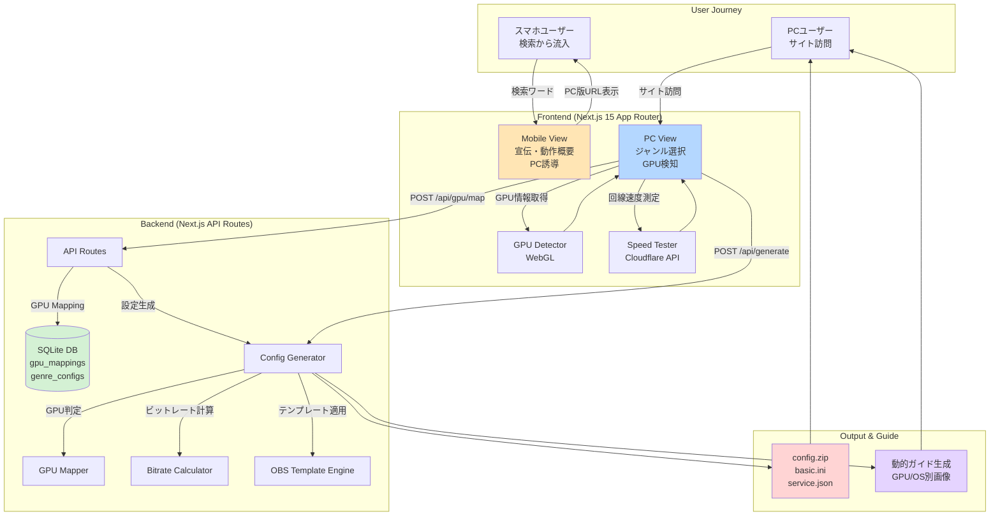
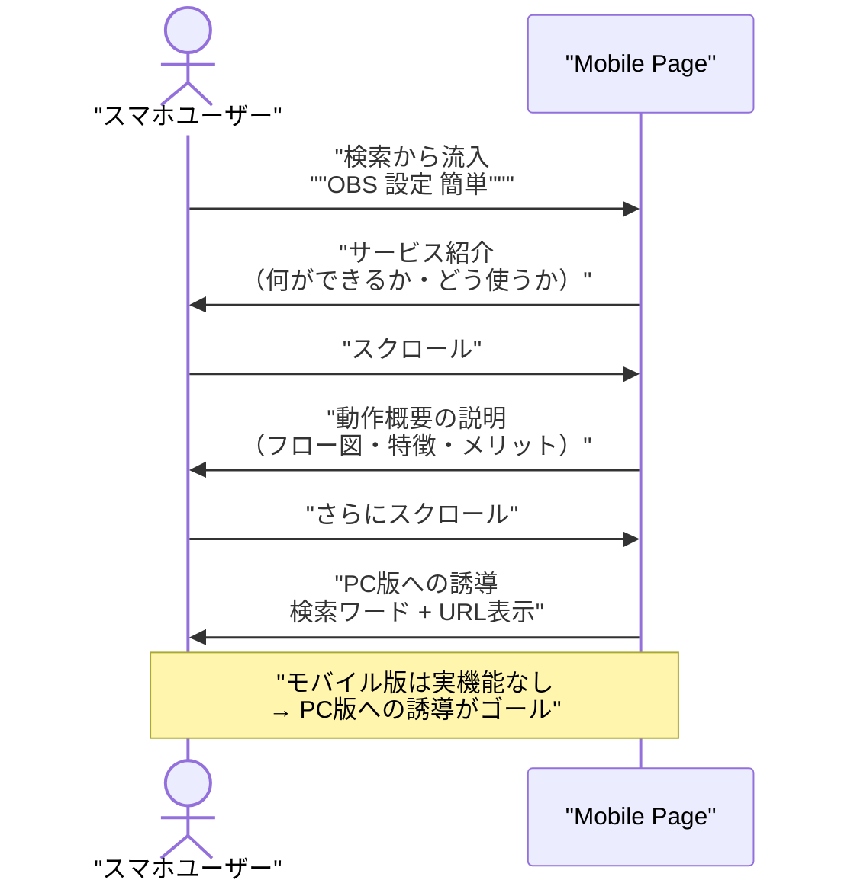
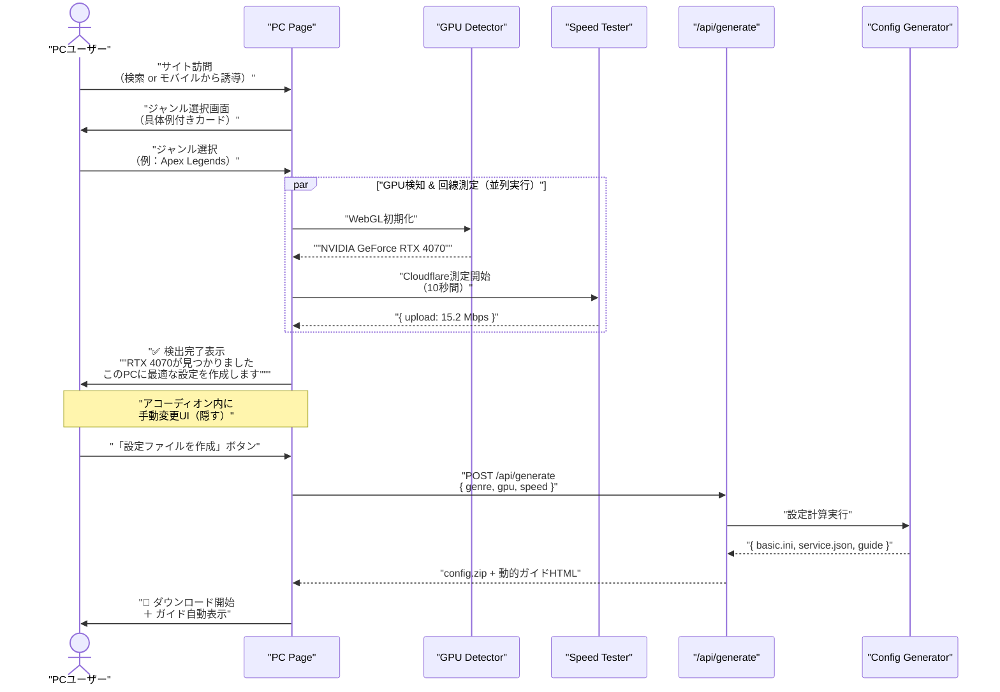
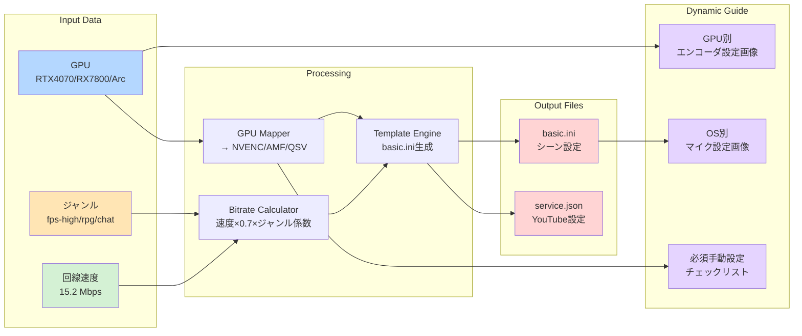
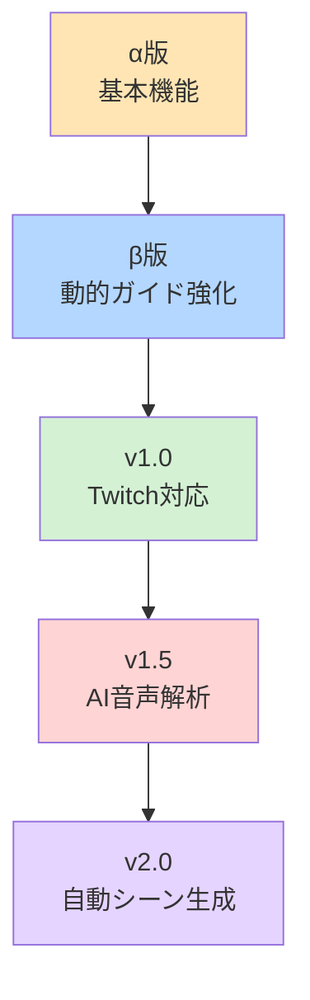

# 全体アーキテクチャ設計書
**Project:** オートOBS設定（YouTube Live特化型OBS設定自動生成）
**Version:** 1.0.0
**Last Updated:** 2026-02-11
**Priority:** UX最優先 - ユーザーを手放さない設計

---

## 1. アーキテクチャ概要

### 1.1 システム全体図（Mermaid）

---

## 2. 技術スタック詳細

### 2.1 Frontend

| カテゴリ | 技術 | 選定理由（UX最優先） |
|---------|------|---------------------|
| **Framework** | Next.js 15 (App Router) | SSR/SSGでSEO対策、初回表示高速化 |
| **Language** | TypeScript 5 | 型安全性、開発速度向上 |
| **UI Library** | shadcn/ui (Radix UI) | アクセシビリティ標準対応、カスタマイズ容易 |
| **Styling** | Tailwind CSS 4 | 高速開発、レスポンシブ対応が容易 |
| **State** | React Server Components + useOptimistic | サーバー状態を直接利用、楽観的UI更新 |
| **Form** | React Hook Form + Zod | バリデーション高速、エラー表示最小化 |
| **Animation** | Framer Motion | マイクロインタラクション、待ち時間の体感短縮 |

### 2.2 Backend

| カテゴリ | 技術 | 選定理由 |
|---------|------|---------|
| **API** | Next.js API Routes + Server Actions | フロントと統合、デプロイ簡単 |
| **DB** | SQLite (better-sqlite3) | セットアップ不要、高速、セッション管理に最適 |
| **Session** | 4桁16進数コード + 24h TTL | 覚えやすい、入力ミス検知しやすい |
| **GPU検知** | WebGL API (WEBGL_debug_renderer_info) | ブラウザ標準、インストール不要 |
| **回線測定** | Cloudflare Speed Test API | 無料、高精度、グローバル対応 |

### 2.3 Deployment

| 環境 | サービス | 設定 |
|-----|---------|------|
| **Hosting** | Vercel | Next.js最適化、自動CDN配信 |
| **API** | Vercel Edge Functions | 低レイテンシ、グローバル展開 |
| **DB** | Vercel Blob Storage (SQLite) | ステートフル、永続化 |
| **Domain** | 短いドメイン推奨 | 例: `obs.auto` or `obsset.jp` |

---

## 3. システムフロー詳細

### 3.1 スマホ側フロー（Mobile View）

**UX配慮ポイント:**
- 検索流入直後、3秒以内に「何ができるか」を理解させる
- シンプルなランディングページ設計
- PC版URLと検索ワードを大きく表示
- 「専門知識不要」「3分で完了」などのメリット明示

---

### 3.2 PC側フロー（PC View）

**UX配慮ポイント:**
- ジャンルは**ゲームタイトルで選ばせる**（「高負荷」等の専門用語排除）
- GPU検知中は**実際のGPU画像**をアニメーション表示
- 回線測定中は「**あなたの回線は配信に十分な速度です**」等の安心メッセージ
- 検知結果が違う場合のみ、折りたたみ内に手動変更UIを配置（98%のユーザーは触らない設計）

---

## 4. データフロー図

---

## 5. 非機能要件（UX最優先）

### 5.1 パフォーマンス

| 項目 | 目標値 | 実装方法 |
|-----|--------|---------|
| **初回表示** | 1.5秒以内 | Next.js SSR、画像最適化（WebP） |
| **GPU検知** | 2秒以内 | WebGL初期化、キャッシュ活用 |
| **回線測定** | 10秒以内 | 並列実行、タイムアウト15秒 |
| **ファイル生成** | 3秒以内 | Server Actions、ストリーミングレスポンス |
| **TTI (Time to Interactive)** | 2秒以内 | JavaScript分割、Lazy Load |

### 5.2 ユーザビリティ

| 原則 | 実装内容 |
|-----|---------|
| **専門用語ゼロ** | 「ビットレート」→「画質の良さ」、「エンコーダ」→表示しない |
| **選択肢は3つまで** | ジャンル選択も「高画質ゲーム/軽いゲーム/雑談」の3択 |
| **デフォルト値を明示** | 「ほとんどの人はこれでOK」をラベル表示 |
| **エラーを見せない** | 検知失敗時は自動でフォールバック値を使用 |
| **進捗を常に表示** | プログレスバー、アニメーション、残り時間表示 |

### 5.3 アクセシビリティ

| 項目 | 対応内容 |
|-----|---------|
| **ARIA属性** | shadcn/uiのRadix UI Primitivesで自動対応 |
| **キーボード操作** | Tab順序、Enter/Space対応 |
| **カラーコントラスト** | WCAG AA準拠（4.5:1以上） |
| **スクリーンリーダー** | role属性、aria-label適切に配置 |

### 5.4 SEO対策

| 施策 | 実装方法 |
|-----|---------|
| **メタタグ最適化** | Next.js Metadata API活用 |
| **ターゲットKW** | 「OBS 設定 自動」「YouTube配信 初心者」「OBS 簡単設定」 |
| **構造化データ** | HowTo Schema, FAQPage Schema |
| **Core Web Vitals** | LCP < 2.5s, FID < 100ms, CLS < 0.1 |

---

## 6. セキュリティ設計

### 6.1 脅威モデル

| 脅威 | 対策 |
|-----|------|
| **セッションハイジャック** | 4桁コードは推測困難（16^4=65536通り）+ 24h TTL |
| **Rate Limiting** | IPベース：10req/min、セッション生成：5req/hour |
| **XSS** | Next.jsの自動エスケープ、CSP Header設定 |
| **CSRF** | Server Actionsのトークンベリフィケーション |
| **SQLインジェクション** | Prepared Statements、ORMレイヤー |

### 6.2 プライバシー

| 項目 | 方針 |
|-----|------|
| **個人情報収集** | なし（メアド、名前等不要） |
| **GPU情報** | クライアント側のみ、サーバーに保存しない |
| **セッションデータ** | 24h後自動削除、ジャンル選択のみ保存 |
| **Analytics** | Vercel Analytics（匿名化済み） |

---

## 7. 拡張性設計

### 7.1 Phase 2以降の拡張ポイント

| Version | 追加機能 | 技術要件 |
|---------|---------|---------|
| **α版** | スマホ連携、GPU検知、基本ファイル生成 | 現行スタック |
| **β版** | 動的ガイド、回線測定、エラーリカバリー | 画像生成API追加 |
| **v1.0** | Twitch対応、マルチストリーム設定 | service.json拡張 |
| **v1.5** | マイク音質AI診断、ノイズ除去設定提案 | WebAudio API、ML.js |
| **v2.0** | シーン自動生成（配信内容から逆算） | OpenAI API、画像認識 |

---

## 8. 技術的負債管理

### 8.1 既知の制約

| 制約 | 理由 | 将来の解消方法 |
|-----|------|--------------|
| **SQLiteの同時書き込み** | 単一ファイルDB | PostgreSQL移行（月間1万セッション超時） |
| **WebGL検知の精度** | ブラウザ依存 | Electron版アプリで直接取得 |
| **回線測定の誤差** | 測定タイミング依存 | 複数回測定の平均値使用 |

---

## 9. 監視・ログ設計

### 9.1 計測指標

| 指標 | ツール | 目的 |
|-----|--------|------|
| **ページビュー** | Vercel Analytics | 流入経路分析 |
| **GPU検知成功率** | Custom Event | 検知精度改善 |
| **ファイル生成成功率** | Custom Event | エラー原因特定 |
| **離脱ポイント** | Funnel分析 | UX改善 |
| **平均滞在時間** | Session Replay | ボトルネック特定 |

---

## 10. まとめ

このアーキテクチャは以下の原則で設計されています：

1. **ユーザーを手放さない** - 待ち時間ゼロ、エラー画面ゼロ
2. **専門知識不要** - 全て具体例と平易な言葉で説明
3. **最短経路** - 画面遷移3回以内で完結
4. **信頼性** - GPU検知失敗でも必ず設定ファイルを生成
5. **拡張性** - Phase 2以降の機能追加を見据えた設計

**Next Step:** `data-schema.md` でDB設計とマッピングテーブルを定義します。
