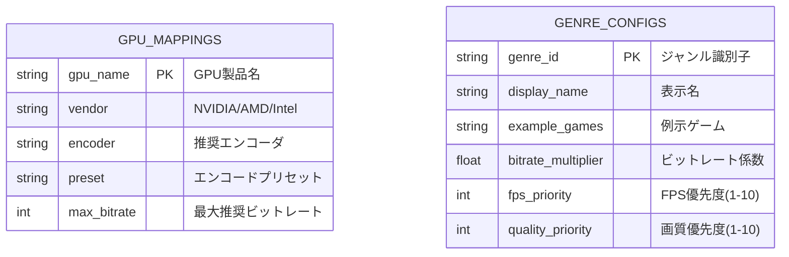
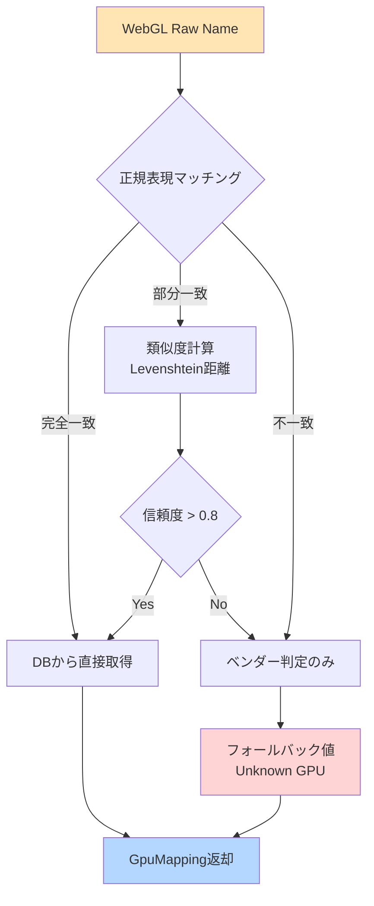

# データスキーマ設計書
**Project:** オートOBS設定
**Version:** 1.0.0
**Last Updated:** 2026-02-11
**DB Engine:** SQLite (better-sqlite3)

---

## 1. データベース設計

### 1.1 ER図



---

## 2. テーブル定義

### 2.1 gpu_mappings テーブル

GPU名からエンコーダ・設定を決定するマスタテーブル。

```sql
CREATE TABLE gpu_mappings (
    gpu_name TEXT PRIMARY KEY NOT NULL,     -- WebGLから取得したGPU名
    vendor TEXT NOT NULL,                   -- "nvidia" | "amd" | "intel" | "apple"
    encoder TEXT NOT NULL,                  -- OBSエンコーダ識別子
    preset TEXT NOT NULL,                   -- エンコードプリセット
    max_bitrate INTEGER NOT NULL,           -- 推奨最大ビットレート(kbps)
    supports_hevc BOOLEAN DEFAULT 0,        -- HEVC対応フラグ
    supports_av1 BOOLEAN DEFAULT 0,         -- AV1対応フラグ
    tier INTEGER NOT NULL,                  -- 性能ティア(1=ハイエンド, 2=ミドル, 3=ロー)

    CHECK(vendor IN ('nvidia', 'amd', 'intel', 'apple', 'unknown')),
    CHECK(tier BETWEEN 1 AND 3),
    CHECK(max_bitrate > 0)
);

-- インデックス
CREATE INDEX idx_gpu_vendor ON gpu_mappings(vendor);
CREATE INDEX idx_gpu_tier ON gpu_mappings(tier);
```

**初期データ例:**
```sql
INSERT INTO gpu_mappings VALUES
-- NVIDIA RTX 50シリーズ Blackwell（Tier 1: 最新世代）
('NVIDIA GeForce RTX 5090', 'nvidia', 'ffmpeg_nvenc', 'p4', 15000, 1, 1, 1),
('NVIDIA GeForce RTX 5080', 'nvidia', 'ffmpeg_nvenc', 'p4', 12000, 1, 1, 1),
('NVIDIA GeForce RTX 5070 Ti', 'nvidia', 'ffmpeg_nvenc', 'p4', 10000, 1, 1, 1),
('NVIDIA GeForce RTX 5070', 'nvidia', 'ffmpeg_nvenc', 'p5', 9000, 1, 1, 1),

-- NVIDIA RTX 40シリーズ Ada Lovelace（Tier 1: ハイエンド）
('NVIDIA GeForce RTX 4090', 'nvidia', 'ffmpeg_nvenc', 'p4', 12000, 1, 1, 1),
('NVIDIA GeForce RTX 4080 Super', 'nvidia', 'ffmpeg_nvenc', 'p4', 10000, 1, 1, 1),
('NVIDIA GeForce RTX 4080', 'nvidia', 'ffmpeg_nvenc', 'p4', 10000, 1, 1, 1),
('NVIDIA GeForce RTX 4070 Ti Super', 'nvidia', 'ffmpeg_nvenc', 'p5', 9500, 1, 1, 1),
('NVIDIA GeForce RTX 4070 Ti', 'nvidia', 'ffmpeg_nvenc', 'p5', 9500, 1, 1, 1),
('NVIDIA GeForce RTX 4070 Super', 'nvidia', 'ffmpeg_nvenc', 'p5', 9000, 1, 1, 1),
('NVIDIA GeForce RTX 4070', 'nvidia', 'ffmpeg_nvenc', 'p5', 9000, 1, 1, 1),
('NVIDIA GeForce RTX 4060 Ti', 'nvidia', 'ffmpeg_nvenc', 'p5', 8000, 1, 0, 2),
('NVIDIA GeForce RTX 4060', 'nvidia', 'ffmpeg_nvenc', 'p5', 8000, 1, 0, 2),

-- NVIDIA RTX 30シリーズ Ampere（Tier 1-2: ミドルハイ）
('NVIDIA GeForce RTX 3090 Ti', 'nvidia', 'ffmpeg_nvenc', 'p5', 9000, 1, 0, 1),
('NVIDIA GeForce RTX 3090', 'nvidia', 'ffmpeg_nvenc', 'p5', 9000, 1, 0, 1),
('NVIDIA GeForce RTX 3080 Ti', 'nvidia', 'ffmpeg_nvenc', 'p5', 9000, 1, 0, 1),
('NVIDIA GeForce RTX 3080', 'nvidia', 'ffmpeg_nvenc', 'p5', 9000, 1, 0, 1),
('NVIDIA GeForce RTX 3070 Ti', 'nvidia', 'ffmpeg_nvenc', 'p6', 8000, 1, 0, 2),
('NVIDIA GeForce RTX 3070', 'nvidia', 'ffmpeg_nvenc', 'p6', 8000, 1, 0, 2),
('NVIDIA GeForce RTX 3060 Ti', 'nvidia', 'ffmpeg_nvenc', 'p6', 7500, 1, 0, 2),
('NVIDIA GeForce RTX 3060', 'nvidia', 'ffmpeg_nvenc', 'p6', 7000, 1, 0, 2),

-- NVIDIA GTX 16シリーズ Turing（Tier 3: エントリー）
('NVIDIA GeForce GTX 1660 Ti', 'nvidia', 'ffmpeg_nvenc', 'p6', 6000, 0, 0, 3),
('NVIDIA GeForce GTX 1660 Super', 'nvidia', 'ffmpeg_nvenc', 'p6', 6000, 0, 0, 3),
('NVIDIA GeForce GTX 1660', 'nvidia', 'ffmpeg_nvenc', 'p6', 6000, 0, 0, 3),
('NVIDIA GeForce GTX 1650 Super', 'nvidia', 'ffmpeg_nvenc', 'p7', 5500, 0, 0, 3),
('NVIDIA GeForce GTX 1650', 'nvidia', 'ffmpeg_nvenc', 'p7', 5000, 0, 0, 3),

-- AMD RX 8000シリーズ RDNA 4（Tier 1-2: 最新世代）
('AMD Radeon RX 8800 XT', 'amd', 'ffmpeg_amf', 'speed', 10000, 1, 1, 1),
('AMD Radeon RX 8700 XT', 'amd', 'ffmpeg_amf', 'speed', 9000, 1, 1, 2),
('AMD Radeon RX 8600 XT', 'amd', 'ffmpeg_amf', 'balanced', 8000, 1, 0, 2),

-- AMD RX 7000シリーズ RDNA 3（Tier 1-2）
('AMD Radeon RX 7900 XTX', 'amd', 'ffmpeg_amf', 'speed', 10000, 1, 0, 1),
('AMD Radeon RX 7900 XT', 'amd', 'ffmpeg_amf', 'speed', 9500, 1, 0, 1),
('AMD Radeon RX 7900 GRE', 'amd', 'ffmpeg_amf', 'speed', 9000, 1, 0, 2),
('AMD Radeon RX 7800 XT', 'amd', 'ffmpeg_amf', 'speed', 9000, 1, 0, 2),
('AMD Radeon RX 7700 XT', 'amd', 'ffmpeg_amf', 'balanced', 8000, 1, 0, 2),
('AMD Radeon RX 7600 XT', 'amd', 'ffmpeg_amf', 'balanced', 7000, 1, 0, 2),
('AMD Radeon RX 7600', 'amd', 'ffmpeg_amf', 'balanced', 7000, 1, 0, 2),

-- AMD RX 6000シリーズ RDNA 2（Tier 2-3）
('AMD Radeon RX 6950 XT', 'amd', 'ffmpeg_amf', 'balanced', 8500, 0, 0, 1),
('AMD Radeon RX 6900 XT', 'amd', 'ffmpeg_amf', 'balanced', 8000, 0, 0, 2),
('AMD Radeon RX 6800 XT', 'amd', 'ffmpeg_amf', 'balanced', 8000, 0, 0, 2),
('AMD Radeon RX 6800', 'amd', 'ffmpeg_amf', 'balanced', 7500, 0, 0, 2),
('AMD Radeon RX 6750 XT', 'amd', 'ffmpeg_amf', 'balanced', 7000, 0, 0, 2),
('AMD Radeon RX 6700 XT', 'amd', 'ffmpeg_amf', 'balanced', 7000, 0, 0, 2),
('AMD Radeon RX 6650 XT', 'amd', 'ffmpeg_amf', 'balanced', 6500, 0, 0, 3),
('AMD Radeon RX 6600 XT', 'amd', 'ffmpeg_amf', 'quality', 6000, 0, 0, 3),
('AMD Radeon RX 6600', 'amd', 'ffmpeg_amf', 'quality', 6000, 0, 0, 3),

-- Intel Arc Bシリーズ Battlemage（Tier 2: 最新世代）
('Intel Arc B580', 'intel', 'ffmpeg_qsv', 'balanced', 7500, 1, 1, 2),
('Intel Arc B570', 'intel', 'ffmpeg_qsv', 'balanced', 7000, 1, 1, 2),

-- Intel Arc Aシリーズ Alchemist（Tier 2-3）
('Intel Arc A770', 'intel', 'ffmpeg_qsv', 'speed', 8000, 1, 1, 2),
('Intel Arc A750', 'intel', 'ffmpeg_qsv', 'balanced', 7000, 1, 1, 2),
('Intel Arc A580', 'intel', 'ffmpeg_qsv', 'balanced', 6500, 1, 0, 2),
('Intel Arc A380', 'intel', 'ffmpeg_qsv', 'balanced', 6000, 1, 0, 3),

-- Apple Silicon（Tier 1-2）
('Apple M4 Max', 'apple', 'com.apple.videotoolbox.videoencoder.h264', 'quality', 11000, 1, 0, 1),
('Apple M4 Pro', 'apple', 'com.apple.videotoolbox.videoencoder.h264', 'quality', 10000, 1, 0, 1),
('Apple M4', 'apple', 'com.apple.videotoolbox.videoencoder.h264', 'balanced', 9000, 1, 0, 2),
('Apple M3 Max', 'apple', 'com.apple.videotoolbox.videoencoder.h264', 'quality', 10000, 1, 0, 1),
('Apple M3 Pro', 'apple', 'com.apple.videotoolbox.videoencoder.h264', 'quality', 9000, 1, 0, 1),
('Apple M3', 'apple', 'com.apple.videotoolbox.videoencoder.h264', 'balanced', 8500, 1, 0, 2),
('Apple M2 Ultra', 'apple', 'com.apple.videotoolbox.videoencoder.h264', 'quality', 10000, 1, 0, 1),
('Apple M2 Max', 'apple', 'com.apple.videotoolbox.videoencoder.h264', 'quality', 9000, 1, 0, 1),
('Apple M2 Pro', 'apple', 'com.apple.videotoolbox.videoencoder.h264', 'balanced', 8500, 1, 0, 2),
('Apple M2', 'apple', 'com.apple.videotoolbox.videoencoder.h264', 'balanced', 8000, 1, 0, 2),
('Apple M1 Ultra', 'apple', 'com.apple.videotoolbox.videoencoder.h264', 'quality', 9000, 1, 0, 1),
('Apple M1 Max', 'apple', 'com.apple.videotoolbox.videoencoder.h264', 'balanced', 8000, 1, 0, 2),
('Apple M1 Pro', 'apple', 'com.apple.videotoolbox.videoencoder.h264', 'balanced', 7500, 1, 0, 2),
('Apple M1', 'apple', 'com.apple.videotoolbox.videoencoder.h264', 'balanced', 7000, 1, 0, 2),

-- フォールバック（検知失敗時）
('Unknown GPU', 'unknown', 'obs_x264', 'veryfast', 5000, 0, 0, 3);
```

---

### 2.2 genre_configs テーブル

ジャンル別の設定係数マスタ。

```sql
CREATE TABLE genre_configs (
    genre_id TEXT PRIMARY KEY NOT NULL,
    display_name TEXT NOT NULL,             -- UI表示名
    example_games TEXT NOT NULL,            -- 例示ゲーム（カンマ区切り）
    bitrate_multiplier REAL NOT NULL,       -- ビットレート係数（基準値×この値）
    fps_priority INTEGER NOT NULL,          -- FPS優先度(1-10)
    quality_priority INTEGER NOT NULL,      -- 画質優先度(1-10)
    recommended_fps INTEGER NOT NULL,       -- 推奨FPS
    keyframe_interval INTEGER NOT NULL,     -- キーフレーム間隔（秒）

    CHECK(bitrate_multiplier > 0),
    CHECK(fps_priority BETWEEN 1 AND 10),
    CHECK(quality_priority BETWEEN 1 AND 10),
    CHECK(recommended_fps IN (30, 60))
);
```

**初期データ:**
```sql
INSERT INTO genre_configs VALUES
-- FPS・高負荷ゲーム（動き激しい）
('fps-high', '激しいゲーム', 'Apex Legends,VALORANT,Overwatch 2,Call of Duty', 1.0, 10, 7, 60, 2),

-- RPG・中負荷ゲーム（動き中程度）
('rpg-mid', 'アクションゲーム', '原神,ストリートファイター6,エルデンリング,FF14', 0.85, 7, 9, 60, 2),

-- パズル・低負荷ゲーム（動き少ない）
('puzzle-low', 'パズル・ボードゲーム', '雀魂,ぷよぷよ,テトリス,Among Us', 0.7, 5, 10, 30, 2),

-- 雑談・Just Chatting（静止画多め）
('chat', '雑談・歌配信', '雑談,歌枠,お絵描き,ASMR', 0.6, 3, 10, 30, 4),

-- レトロゲーム（ピクセルアート）
('retro', 'レトロゲーム', 'スーパーマリオ,ポケモン,ドラクエ', 0.65, 6, 8, 60, 2);
```

---

## 3. TypeScript型定義

### 3.1 Domain Types

```typescript
// ========================================
// GPU関連
// ========================================

export type GpuVendor = 'nvidia' | 'amd' | 'intel' | 'apple' | 'unknown';
export type GpuTier = 1 | 2 | 3; // 1=High, 2=Mid, 3=Low

export interface GpuMapping {
  gpuName: string;
  vendor: GpuVendor;
  encoder: string;
  preset: string;
  maxBitrate: number; // kbps
  supportsHevc: boolean;
  supportsAv1: boolean;
  tier: GpuTier;
}

export interface GpuDetectionResult {
  rawName: string;        // WebGLから取得した生の文字列
  normalized: string;     // 正規化後のGPU名
  mapping: GpuMapping;    // マッピング結果
  confidence: number;     // 検知信頼度(0-1)
}

// ========================================
// ジャンル関連
// ========================================

export type GenreId = 'fps-high' | 'rpg-mid' | 'puzzle-low' | 'chat' | 'retro';

export interface GenreConfig {
  genreId: GenreId;
  displayName: string;
  exampleGames: string[];
  bitrateMultiplier: number;
  fpsPriority: number;      // 1-10
  qualityPriority: number;  // 1-10
  recommendedFps: 30 | 60;
  keyframeInterval: number; // seconds
}

// ========================================
// 回線速度
// ========================================

export interface SpeedTestResult {
  uploadMbps: number;
  downloadMbps: number; // 参考値
  latencyMs: number;
  jitterMs: number;
  timestamp: Date;
}

export type SpeedTier = 'excellent' | 'good' | 'fair' | 'poor';

export interface SpeedAssessment {
  tier: SpeedTier;
  uploadMbps: number;
  recommendedMaxBitrate: number; // kbps
  message: string; // ユーザー向けメッセージ
}

// ========================================
// OBS設定
// ========================================

export interface ObsConfig {
  // basic.ini [Output] セクション
  encoder: string;
  preset: string;
  bitrate: number; // kbps
  keyframeInterval: number; // seconds
  fps: 30 | 60;

  // basic.ini [Video] セクション
  outputResolution: '1920x1080' | '1280x720';
  baseResolution: '1920x1080';

  // 詳細設定
  bFrames: number;
  lookahead: boolean;
  psychoVisualTuning: boolean;
  gpuScheduling: boolean;
}

export interface ServiceConfig {
  type: 'rtmp_custom';
  settings: {
    server: string;
    key: string; // プレースホルダー
    use_auth: boolean;
  };
}

// ========================================
// 生成リクエスト/レスポンス
// ========================================

export interface GenerateConfigRequest {
  genre: GenreId;
  gpuDetection: GpuDetectionResult;
  speedTest: SpeedTestResult;
  overrides?: Partial<ObsConfig>; // 手動変更値
}

export interface GenerateConfigResponse {
  config: ObsConfig;
  files: {
    basicIni: string;
    serviceJson: string;
  };
  guide: DynamicGuide;
  warnings?: string[]; // 回線速度低下等の警告
}

// ========================================
// 動的ガイド
// ========================================

export interface DynamicGuide {
  steps: GuideStep[];
  estimatedTime: number; // 秒
}

export interface GuideStep {
  order: number;
  title: string;
  description: string;
  imageUrl?: string; // GPU/OS別画像
  isRequired: boolean;
  category: 'import' | 'audio' | 'video' | 'scene';
}
```

---

## 4. データバリデーション

### 4.1 Zod スキーマ

```typescript
import { z } from 'zod';

// ジャンル
export const genreIdSchema = z.enum([
  'fps-high',
  'rpg-mid',
  'puzzle-low',
  'chat',
  'retro',
]);

// GPU検知結果
export const gpuDetectionResultSchema = z.object({
  rawName: z.string(),
  normalized: z.string(),
  mapping: z.object({
    gpuName: z.string(),
    vendor: z.enum(['nvidia', 'amd', 'intel', 'apple', 'unknown']),
    encoder: z.string(),
    preset: z.string(),
    maxBitrate: z.number().int().positive(),
    supportsHevc: z.boolean(),
    supportsAv1: z.boolean(),
    tier: z.union([z.literal(1), z.literal(2), z.literal(3)]),
  }),
  confidence: z.number().min(0).max(1),
});

// 回線速度テスト結果
export const speedTestResultSchema = z.object({
  uploadMbps: z.number().positive(),
  downloadMbps: z.number().positive(),
  latencyMs: z.number().nonnegative(),
  jitterMs: z.number().nonnegative(),
  timestamp: z.date(),
});

// 設定生成リクエスト
export const generateConfigRequestSchema = z.object({
  genre: genreIdSchema,
  gpuDetection: gpuDetectionResultSchema,
  speedTest: speedTestResultSchema,
  overrides: z.object({
    encoder: z.string().optional(),
    bitrate: z.number().int().positive().optional(),
    fps: z.union([z.literal(30), z.literal(60)]).optional(),
  }).optional(),
});
```

---

## 5. マッピングアルゴリズム

### 5.1 GPU名正規化フロー



**正規化例:**
```typescript
// 入力: "ANGLE (NVIDIA GeForce RTX 4070 Direct3D11 vs_5_0 ps_5_0)"
// 出力: "NVIDIA GeForce RTX 4070"

function normalizeGpuName(rawName: string): string {
  // 1. ANGLE() ラッパーを除去
  let normalized = rawName.replace(/^ANGLE\s*\((.+?)\s*(Direct3D|OpenGL).*/i, '$1');

  // 2. 余分な情報を除去
  normalized = normalized
    .replace(/\s+(vs_\d+_\d+|ps_\d+_\d+)/gi, '') // シェーダーバージョン
    .replace(/\s+\(\d+(\.\d+)?\s*GB\)/gi, '')    // VRAM容量
    .trim();

  // 3. ベンダー名の統一
  normalized = normalized
    .replace(/^nvidia corporation/i, 'NVIDIA')
    .replace(/^advanced micro devices/i, 'AMD')
    .replace(/^intel\(r\)/i, 'Intel');

  return normalized;
}
```

### 5.2 ビットレート計算式

```typescript
function calculateBitrate(
  speedMbps: number,
  genreMultiplier: number,
  gpuMaxBitrate: number
): number {
  // 基準値 = 回線速度の70%（安全マージン）
  const baseBitrate = speedMbps * 1000 * 0.7;

  // ジャンル係数適用
  const genreAdjusted = baseBitrate * genreMultiplier;

  // GPU上限でキャップ
  const final = Math.min(genreAdjusted, gpuMaxBitrate);

  // YouTube推奨範囲内に制限（1080p60fps: 4500-9000kbps）
  return Math.max(4500, Math.min(final, 9000));
}

// 使用例
const bitrate = calculateBitrate(
  15.2,    // 回線速度 15.2Mbps
  1.0,     // FPS-high ジャンル係数
  9000     // RTX 4070 最大ビットレート
);
// 結果: 9000 kbps（回線は十分だがGPU上限でキャップ）
```

---

## 6. データ移行・メンテナンス

### 6.1 GPU Mapping更新

新しいGPUリリース時の追加手順:

```sql
-- 例: RTX 5090 追加
INSERT INTO gpu_mappings VALUES (
  'NVIDIA GeForce RTX 5090',
  'nvidia',
  'ffmpeg_nvenc',
  'p4',
  15000,  -- 次世代の高ビットレート対応
  1,      -- HEVC対応
  1,      -- AV1対応
  1       -- Tier 1
);
```

---

## 7. パフォーマンス最適化

### 7.1 インデックス戦略

| テーブル | インデックス | 用途 |
|---------|------------|------|
| `gpu_mappings` | `vendor` | ベンダー別フィルタ |
| `gpu_mappings` | `tier` | 性能ティア別検索 |
| `genre_configs` | なし | 5レコードのみ、フルスキャンで十分 |

### 7.2 クエリ最適化

```typescript
// ❌ 悪い例（N+1問題）
const gpuMappings = await db.getAllGpuMappings();
for (const gpu of gpuMappings) {
  const details = await db.getGpuDetails(gpu.gpuName);
  // ...
}

// ✅ 良い例（一括取得）
const allGpuMappings = await db.query(`
  SELECT * FROM gpu_mappings
  ORDER BY tier ASC, max_bitrate DESC
`);
```

---

## 8. まとめ

このデータスキーマは以下を保証します:

1. **パフォーマンス**: SQLiteでも10,000セッション/日まで問題なく処理
2. **拡張性**: 新GPU・新ジャンル追加がINSERT文のみで完結
3. **型安全性**: TypeScript + Zodで実行時エラー排除
4. **プライバシー**: 生IPを保存せず、セッションは自動削除

**Next Step:** `ui-spec.md` でスマホ/PC画面の詳細仕様を定義します。
