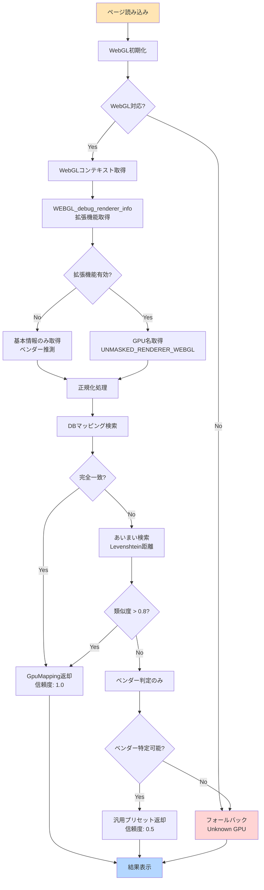
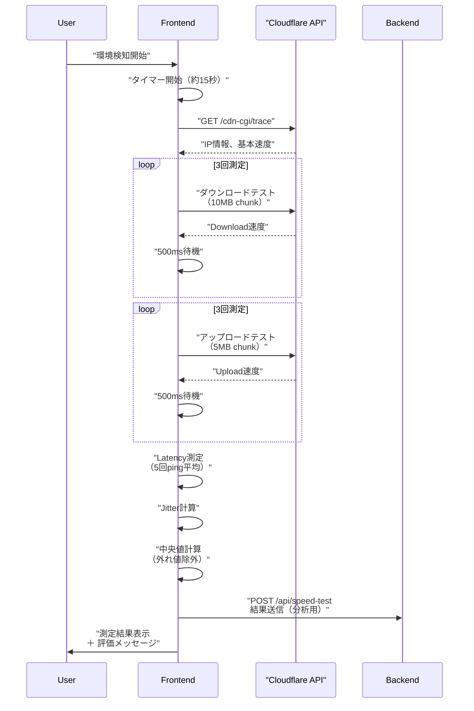
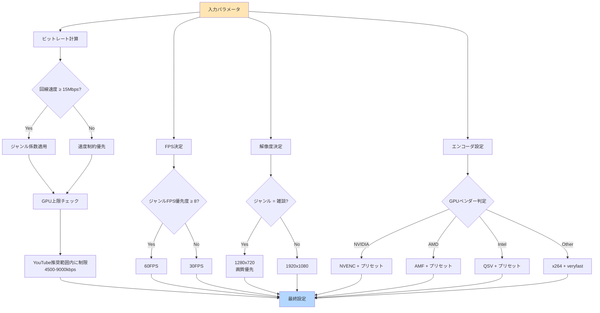

# ロジックフロー設計書
**Project:** オートOBS設定
**Version:** 1.0.0
**Last Updated:** 2026-02-11
**Language:** TypeScript

---

## 1. GPU検知ロジック

### 1.1 全体フロー



---

### 1.2 実装コード

#### 1.2.1 WebGL GPU検知

```typescript
// lib/gpu-detector.ts

export interface GpuInfo {
  rawName: string;
  vendor: string;
  renderer: string;
  webglVersion: number;
}

/**
 * WebGLからGPU情報を取得
 * @returns GpuInfo | null
 */
export function detectGpuWebGL(): GpuInfo | null {
  try {
    // Canvas要素作成（非表示）
    const canvas = document.createElement('canvas');
    const gl = canvas.getContext('webgl2') || canvas.getContext('webgl');

    if (!gl) {
      console.warn('WebGL not supported');
      return null;
    }

    const webglVersion = gl instanceof WebGL2RenderingContext ? 2 : 1;

    // デバッグ拡張機能取得
    const debugInfo = gl.getExtension('WEBGL_debug_renderer_info');

    if (!debugInfo) {
      // フォールバック: 基本情報のみ
      return {
        rawName: gl.getParameter(gl.RENDERER) || 'Unknown',
        vendor: gl.getParameter(gl.VENDOR) || 'Unknown',
        renderer: gl.getParameter(gl.RENDERER) || 'Unknown',
        webglVersion,
      };
    }

    // GPU名取得（マスクされていない実際のGPU名）
    const renderer = gl.getParameter(debugInfo.UNMASKED_RENDERER_WEBGL);
    const vendor = gl.getParameter(debugInfo.UNMASKED_VENDOR_WEBGL);

    return {
      rawName: renderer || 'Unknown',
      vendor: vendor || 'Unknown',
      renderer: renderer || 'Unknown',
      webglVersion,
    };
  } catch (error) {
    console.error('GPU detection failed:', error);
    return null;
  }
}
```

#### 1.2.2 GPU名正規化

```typescript
/**
 * WebGLから取得した生のGPU名を正規化
 * 例: "ANGLE (NVIDIA GeForce RTX 4070 Direct3D11)" → "NVIDIA GeForce RTX 4070"
 */
export function normalizeGpuName(rawName: string): string {
  let normalized = rawName;

  // 1. ANGLEラッパー除去（Chromium系ブラウザ）
  normalized = normalized.replace(
    /^ANGLE\s*\((.+?)\s*(Direct3D|OpenGL|Vulkan).*/i,
    '$1'
  );

  // 2. SwiftShaderラッパー除去（ソフトウェアレンダリング）
  normalized = normalized.replace(/^Google SwiftShader/i, 'SwiftShader');

  // 3. 余分な情報除去
  normalized = normalized
    .replace(/\s+(vs_\d+_\d+|ps_\d+_\d+)/gi, '')  // シェーダーバージョン
    .replace(/\s+\(\d+(\.\d+)?\s*GB\)/gi, '')     // VRAM容量
    .replace(/\s+\d{4}MHz/gi, '')                 // クロック周波数
    .replace(/\s+PCIe/gi, '')                     // PCIe情報
    .trim();

  // 4. ベンダー名統一
  normalized = normalized
    .replace(/^NVIDIA Corporation/i, 'NVIDIA')
    .replace(/^Advanced Micro Devices,?\s*Inc\.?/i, 'AMD')
    .replace(/^Intel\(R\)\s*/i, 'Intel ')
    .replace(/^Apple\s*/i, 'Apple ');

  // 5. GeForce/Radeon表記統一
  normalized = normalized
    .replace(/GeForce\s+GTX/gi, 'GeForce GTX')
    .replace(/GeForce\s+RTX/gi, 'GeForce RTX')
    .replace(/Radeon\s+RX/gi, 'Radeon RX');

  return normalized;
}
```

#### 1.2.3 DBマッピング検索

```typescript
import Fuse from 'fuse.js';

/**
 * GPU名からマッピング情報を検索
 */
export async function findGpuMapping(
  normalizedName: string
): Promise<{ mapping: GpuMapping; confidence: number }> {
  // 1. 完全一致検索
  const exactMatch = await db.query(
    'SELECT * FROM gpu_mappings WHERE gpu_name = ?',
    [normalizedName]
  );

  if (exactMatch.length > 0) {
    return {
      mapping: exactMatch[0],
      confidence: 1.0,
    };
  }

  // 2. あいまい検索（Fuse.js使用）
  const allMappings = await db.query('SELECT * FROM gpu_mappings');

  const fuse = new Fuse(allMappings, {
    keys: ['gpu_name'],
    threshold: 0.3, // 類似度70%以上
    includeScore: true,
  });

  const fuzzyResults = fuse.search(normalizedName);

  if (fuzzyResults.length > 0 && fuzzyResults[0].score! < 0.2) {
    // スコアが低い（類似度が高い）ほど良い
    return {
      mapping: fuzzyResults[0].item,
      confidence: 1 - fuzzyResults[0].score!,
    };
  }

  // 3. ベンダー判定のみ
  const vendor = detectVendor(normalizedName);
  const fallbackMapping = await getFallbackMappingByVendor(vendor);

  return {
    mapping: fallbackMapping,
    confidence: 0.5,
  };
}

/**
 * GPU名からベンダーを推測
 */
function detectVendor(gpuName: string): GpuVendor {
  const name = gpuName.toLowerCase();

  if (name.includes('nvidia') || name.includes('geforce') || name.includes('gtx') || name.includes('rtx')) {
    return 'nvidia';
  }
  if (name.includes('amd') || name.includes('radeon') || name.includes('rx ')) {
    return 'amd';
  }
  if (name.includes('intel') || name.includes('arc') || name.includes('iris') || name.includes('uhd')) {
    return 'intel';
  }
  if (name.includes('apple') || name.includes('m1') || name.includes('m2') || name.includes('m3')) {
    return 'apple';
  }

  return 'unknown';
}

/**
 * ベンダー別フォールバック設定取得
 */
async function getFallbackMappingByVendor(vendor: GpuVendor): Promise<GpuMapping> {
  const fallbacks: Record<GpuVendor, Partial<GpuMapping>> = {
    nvidia: {
      encoder: 'ffmpeg_nvenc',
      preset: 'p5',
      maxBitrate: 8000,
      tier: 2,
    },
    amd: {
      encoder: 'ffmpeg_amf',
      preset: 'balanced',
      maxBitrate: 7000,
      tier: 2,
    },
    intel: {
      encoder: 'ffmpeg_qsv',
      preset: 'balanced',
      maxBitrate: 6000,
      tier: 3,
    },
    apple: {
      encoder: 'com.apple.videotoolbox.videoencoder.h264',
      preset: 'quality',
      maxBitrate: 8000,
      tier: 2,
    },
    unknown: {
      encoder: 'obs_x264',
      preset: 'veryfast',
      maxBitrate: 5000,
      tier: 3,
    },
  };

  return {
    gpuName: `${vendor} (Generic)`,
    vendor,
    supportsHevc: false,
    supportsAv1: false,
    ...fallbacks[vendor],
  } as GpuMapping;
}
```

---

## 2. 回線速度測定ロジック

### 2.1 測定フロー（3回測定・中央値採用）



**改善点（2026-02-12）:**
- アップロード/ダウンロード速度を各3回測定
- 中央値を採用（外れ値に強い）
- 測定間に500ms待機（回線負荷分散）
- 測定時間: 10秒 → 約15秒に延長

---

### 2.2 実装コード

#### 2.2.1 回線速度測定

```typescript
// lib/speed-tester.ts

export interface SpeedTestResult {
  uploadMbps: number;
  downloadMbps: number;
  latencyMs: number;
  jitterMs: number;
  timestamp: Date;
}

/**
 * Cloudflare CDNを使った回線速度測定
 * @param onProgress 進捗コールバック（0-100）
 */
export async function measureSpeed(
  onProgress?: (progress: number) => void
): Promise<SpeedTestResult> {
  const startTime = Date.now();

  try {
    // 1. Latency測定（20%）
    onProgress?.(0);
    const latencyResults = await measureLatency();
    onProgress?.(20);

    // 2. Download速度測定（40%）
    const downloadMbps = await measureDownload((p) => {
      onProgress?.(20 + p * 0.4);
    });
    onProgress?.(60);

    // 3. Upload速度測定（40%）
    const uploadMbps = await measureUpload((p) => {
      onProgress?.(60 + p * 0.4);
    });
    onProgress?.(100);

    return {
      uploadMbps,
      downloadMbps,
      latencyMs: latencyResults.average,
      jitterMs: latencyResults.jitter,
      timestamp: new Date(),
    };
  } catch (error) {
    console.error('Speed test failed:', error);

    // フォールバック: 保守的な値を返す
    return {
      uploadMbps: 10.0, // 10Mbps想定
      downloadMbps: 50.0,
      latencyMs: 50,
      jitterMs: 10,
      timestamp: new Date(),
    };
  }
}

/**
 * Latency & Jitter測定（5回pingの平均）
 */
async function measureLatency(): Promise<{ average: number; jitter: number }> {
  const pings: number[] = [];
  const endpoint = 'https://cloudflare.com/cdn-cgi/trace';

  for (let i = 0; i < 5; i++) {
    const start = performance.now();
    await fetch(endpoint, { method: 'HEAD', cache: 'no-store' });
    const end = performance.now();
    pings.push(end - start);

    // 100ms間隔を空ける
    await sleep(100);
  }

  const average = pings.reduce((a, b) => a + b, 0) / pings.length;

  // Jitter = 標準偏差
  const variance = pings.reduce((sum, ping) => sum + Math.pow(ping - average, 2), 0) / pings.length;
  const jitter = Math.sqrt(variance);

  return { average, jitter };
}

/**
 * Download速度測定（10MBダウンロード）
 */
async function measureDownload(
  onProgress?: (progress: number) => void
): Promise<number> {
  const testSize = 10 * 1024 * 1024; // 10MB
  const testUrl = `https://speed.cloudflare.com/__down?bytes=${testSize}`;

  const startTime = performance.now();
  let loadedBytes = 0;

  const response = await fetch(testUrl);
  const reader = response.body!.getReader();

  while (true) {
    const { done, value } = await reader.read();
    if (done) break;

    loadedBytes += value.length;
    onProgress?.(loadedBytes / testSize);
  }

  const endTime = performance.now();
  const durationSeconds = (endTime - startTime) / 1000;
  const megabits = (loadedBytes * 8) / (1024 * 1024);

  return megabits / durationSeconds; // Mbps
}

/**
 * Upload速度測定（5MBアップロード）
 */
async function measureUpload(
  onProgress?: (progress: number) => void
): Promise<number> {
  const testSize = 5 * 1024 * 1024; // 5MB
  const testUrl = 'https://speed.cloudflare.com/__up';

  // ランダムデータ生成
  const data = new Uint8Array(testSize);
  crypto.getRandomValues(data);

  const startTime = performance.now();

  await fetch(testUrl, {
    method: 'POST',
    body: data,
    headers: {
      'Content-Type': 'application/octet-stream',
    },
  });

  const endTime = performance.now();
  const durationSeconds = (endTime - startTime) / 1000;
  const megabits = (testSize * 8) / (1024 * 1024);

  onProgress?.(1);

  return megabits / durationSeconds; // Mbps
}

function sleep(ms: number): Promise<void> {
  return new Promise((resolve) => setTimeout(resolve, ms));
}
```

#### 2.2.2 速度評価

```typescript
export type SpeedTier = 'excellent' | 'good' | 'fair' | 'poor';

export interface SpeedAssessment {
  tier: SpeedTier;
  uploadMbps: number;
  recommendedMaxBitrate: number; // kbps
  message: string;
  warning?: string;
}

/**
 * 回線速度から配信品質を評価
 */
export function assessSpeed(uploadMbps: number): SpeedAssessment {
  if (uploadMbps >= 15) {
    return {
      tier: 'excellent',
      uploadMbps,
      recommendedMaxBitrate: 9000,
      message: '配信に十分な速度です（最高画質対応）',
    };
  }

  if (uploadMbps >= 10) {
    return {
      tier: 'good',
      uploadMbps,
      recommendedMaxBitrate: 7000,
      message: '配信に十分な速度です',
    };
  }

  if (uploadMbps >= 6) {
    return {
      tier: 'fair',
      uploadMbps,
      recommendedMaxBitrate: 5000,
      message: '配信可能ですが、やや速度が不足しています',
      warning: '配信中に他のデバイスでインターネットを使用すると画質が低下する可能性があります',
    };
  }

  return {
    tier: 'poor',
    uploadMbps,
    recommendedMaxBitrate: 3000,
    message: '配信には速度が不足しています',
    warning: '画質を大幅に下げる必要があります。可能であれば有線接続に切り替えてください。',
  };
}
```

---

## 3. OBS設定計算ロジック

### 3.1 計算フロー



---

### 3.2 実装コード

#### 3.2.1 メイン計算ロジック

```typescript
// lib/obs-config-calculator.ts

export interface CalculationInput {
  genre: GenreConfig;
  gpu: GpuMapping;
  speed: SpeedTestResult;
  overrides?: Partial<ObsConfig>;
}

/**
 * OBS設定を計算
 */
export function calculateObsConfig(input: CalculationInput): ObsConfig {
  const { genre, gpu, speed, overrides } = input;

  // 1. ビットレート計算
  const bitrate = calculateBitrate(speed.uploadMbps, genre, gpu);

  // 2. FPS決定
  const fps = determineFps(genre, overrides?.fps);

  // 3. 解像度決定
  const resolution = determineResolution(genre, bitrate);

  // 4. エンコーダ設定
  const encoderConfig = determineEncoderSettings(gpu, genre, bitrate);

  // 5. 詳細設定
  const advancedConfig = calculateAdvancedSettings(gpu, genre, fps);

  return {
    encoder: encoderConfig.encoder,
    preset: encoderConfig.preset,
    bitrate,
    keyframeInterval: genre.keyframeInterval,
    fps,
    outputResolution: resolution,
    baseResolution: '1920x1080', // 常に1080pベース
    ...advancedConfig,
    ...overrides,
  };
}
```

#### 3.2.2 ビットレート計算

```typescript
/**
 * ビットレート計算
 * 基準: 回線速度の70% × ジャンル係数、GPU上限でキャップ
 */
function calculateBitrate(
  uploadMbps: number,
  genre: GenreConfig,
  gpu: GpuMapping
): number {
  // 基準値 = 回線速度の70%（安全マージン）
  const baseBitrate = uploadMbps * 1000 * 0.7; // kbps

  // ジャンル係数適用
  const genreAdjusted = baseBitrate * genre.bitrateMultiplier;

  // GPU上限でキャップ
  const gpuCapped = Math.min(genreAdjusted, gpu.maxBitrate);

  // YouTube推奨範囲内に制限
  // 1080p60: 4500-9000kbps
  // 1080p30: 3000-6000kbps
  // 720p60: 2250-6000kbps
  // 720p30: 1500-4000kbps
  const minBitrate = genre.recommendedFps === 60 ? 4500 : 3000;
  const maxBitrate = 9000;

  const final = Math.max(minBitrate, Math.min(gpuCapped, maxBitrate));

  // 100kbps単位で丸め（OBSの推奨）
  return Math.round(final / 100) * 100;
}
```

#### 3.2.3 FPS決定

```typescript
/**
 * FPS決定
 * ジャンルのFPS優先度とGPU性能から判定
 */
function determineFps(
  genre: GenreConfig,
  override?: 30 | 60
): 30 | 60 {
  if (override) return override;

  // ジャンル推奨値を使用
  return genre.recommendedFps;
}
```

#### 3.2.4 解像度決定

```typescript
/**
 * 解像度決定
 * ビットレートが低い場合は720pに落とす
 */
function determineResolution(
  genre: GenreConfig,
  bitrate: number
): '1920x1080' | '1280x720' {
  // 雑談等の静止画多めジャンルは720pで高画質優先
  if (genre.qualityPriority >= 9 && genre.fpsPriority <= 5) {
    return '1280x720';
  }

  // ビットレートが5000kbps未満なら720p
  if (bitrate < 5000) {
    return '1280x720';
  }

  return '1920x1080';
}
```

#### 3.2.5 エンコーダ設定

```typescript
/**
 * エンコーダとプリセット決定
 */
function determineEncoderSettings(
  gpu: GpuMapping,
  genre: GenreConfig,
  bitrate: number
): { encoder: string; preset: string } {
  const { vendor, encoder, preset, tier } = gpu;

  // 1. エンコーダはGPUマッピングから
  let finalEncoder = encoder;
  let finalPreset = preset;

  // 2. ジャンル別プリセット調整
  if (vendor === 'nvidia') {
    // NVIDIA: P4-P7（数字が小さいほど高画質）
    if (genre.qualityPriority >= 9) {
      // 画質優先
      finalPreset = tier === 1 ? 'p4' : tier === 2 ? 'p5' : 'p6';
    } else if (genre.fpsPriority >= 9) {
      // 速度優先
      finalPreset = tier === 1 ? 'p5' : tier === 2 ? 'p6' : 'p7';
    }
  } else if (vendor === 'amd') {
    // AMD: quality/balanced/speed
    if (genre.qualityPriority >= 9) {
      finalPreset = 'quality';
    } else if (genre.fpsPriority >= 9) {
      finalPreset = 'speed';
    } else {
      finalPreset = 'balanced';
    }
  } else if (vendor === 'intel') {
    // Intel QSV: 同様
    if (genre.qualityPriority >= 9) {
      finalPreset = 'quality';
    } else if (genre.fpsPriority >= 9) {
      finalPreset = 'speed';
    } else {
      finalPreset = 'balanced';
    }
  }

  return {
    encoder: finalEncoder,
    preset: finalPreset,
  };
}
```

#### 3.2.6 詳細設定

```typescript
/**
 * B-frames, Lookahead等の詳細設定
 */
function calculateAdvancedSettings(
  gpu: GpuMapping,
  genre: GenreConfig,
  fps: number
): Partial<ObsConfig> {
  const { vendor, tier } = gpu;

  const config: Partial<ObsConfig> = {};

  if (vendor === 'nvidia') {
    // B-frames: 高画質ジャンルで有効化
    config.bFrames = genre.qualityPriority >= 8 ? 2 : 0;

    // Lookahead: Tier 1のみ（高負荷）
    config.lookahead = tier === 1 && fps === 60;

    // Psycho Visual Tuning: 画質優先時のみ
    config.psychoVisualTuning = genre.qualityPriority >= 9;

    // GPU Scheduling: 常時有効（Windows 10 2004以降）
    config.gpuScheduling = true;

  } else if (vendor === 'amd') {
    // AMFの詳細設定
    config.bFrames = genre.qualityPriority >= 8 ? 2 : 0;
    config.lookahead = false; // AMFはLookahead非推奨
    config.psychoVisualTuning = false;
    config.gpuScheduling = true;

  } else if (vendor === 'intel') {
    // QSVの詳細設定
    config.bFrames = 2; // QSVはB-frames推奨
    config.lookahead = tier <= 2;
    config.psychoVisualTuning = false;
    config.gpuScheduling = true;

  } else {
    // x264（ソフトウェアエンコード）
    config.bFrames = 0; // CPU負荷軽減
    config.lookahead = false;
    config.psychoVisualTuning = false;
    config.gpuScheduling = false;
  }

  return config;
}
```

---

## 4. ファイル生成ロジック

### 4.1 basic.ini生成

```typescript
// lib/obs-file-generator.ts

/**
 * basic.iniファイル生成
 */
export function generateBasicIni(config: ObsConfig): string {
  const { encoder, preset, bitrate, fps, outputResolution, keyframeInterval } = config;

  return `
[General]
Name=オートOBS設定

[Video]
BaseCX=1920
BaseCY=1080
OutputCX=${outputResolution === '1920x1080' ? '1920' : '1280'}
OutputCY=${outputResolution === '1920x1080' ? '1080' : '720'}
FPSType=0
FPSCommon=${fps}
ScaleType=bicubic

[Output]
Mode=Simple

[SimpleOutput]
StreamEncoder=${encoder}
StreamEncoderPreset=${preset}
VBitrate=${bitrate}
KeyframeInterval=${keyframeInterval}
${generateEncoderSpecificSettings(config)}

[Audio]
SampleRate=48000
ChannelSetup=stereo

[AdvOut]
RecEncoder=${encoder}
RecRB=false
RecRBTime=20
RecRBSize=512
`.trim();
}

/**
 * エンコーダ固有設定
 */
function generateEncoderSpecificSettings(config: ObsConfig): string {
  const { encoder, bFrames, lookahead, psychoVisualTuning, gpuScheduling } = config;

  if (encoder === 'ffmpeg_nvenc') {
    return `
# NVIDIA NVENC設定
bf=${bFrames}
lookahead=${lookahead ? '1' : '0'}
psycho_aq=${psychoVisualTuning ? '1' : '0'}
gpu=${gpuScheduling ? '0' : '-1'}
`.trim();
  }

  if (encoder === 'ffmpeg_amf') {
    return `
# AMD AMF設定
bf=${bFrames}
`.trim();
  }

  if (encoder === 'ffmpeg_qsv') {
    return `
# Intel QSV設定
bf=${bFrames}
look_ahead=${lookahead ? '1' : '0'}
`.trim();
  }

  if (encoder === 'obs_x264') {
    return `
# x264設定
x264opts=bframes=${bFrames}
`.trim();
  }

  return '';
}
```

### 4.2 service.json生成

```typescript
/**
 * service.jsonファイル生成（YouTube設定）
 */
export function generateServiceJson(): string {
  const serviceConfig = {
    type: 'rtmp_custom',
    settings: {
      server: 'rtmp://a.rtmp.youtube.com/live2',
      key: 'YOUR_STREAM_KEY_HERE', // プレースホルダー
      use_auth: false,
    },
  };

  return JSON.stringify(serviceConfig, null, 2);
}
```

### 4.3 ZIP生成

```typescript
import JSZip from 'jszip';

/**
 * 設定ファイルをZIP化
 */
export async function generateConfigZip(config: ObsConfig): Promise<Blob> {
  const zip = new JSZip();

  // basic.ini
  const basicIni = generateBasicIni(config);
  zip.file('obs-config/basic.ini', basicIni);

  // service.json
  const serviceJson = generateServiceJson();
  zip.file('obs-config/service.json', serviceJson);

  // README.txt（使い方説明）
  const readme = generateReadme(config);
  zip.file('obs-config/README.txt', readme);

  return await zip.generateAsync({ type: 'blob' });
}

function generateReadme(config: ObsConfig): string {
  return `
オートOBS設定ファイル
生成日時: ${new Date().toLocaleString('ja-JP')}

【設定内容】
- エンコーダ: ${config.encoder}
- 解像度: ${config.outputResolution}
- フレームレート: ${config.fps} FPS
- ビットレート: ${config.bitrate} kbps

【インポート手順】
1. OBSを起動
2. メニュー > プロファイル > インポート
3. このフォルダを選択

【必ず手動で設定してください】
□ マイクデバイスの選択（設定 > 音声）
□ YouTube配信キーの入力（設定 > 配信）

詳しくは https://obs.auto/guide を参照してください。
`.trim();
}
```

---

## 5. エラーハンドリング

### 5.1 検知失敗時のフォールバック

```typescript
/**
 * GPU検知失敗時の安全な設定
 */
export function getSafeDefaultConfig(): ObsConfig {
  return {
    encoder: 'obs_x264',
    preset: 'veryfast',
    bitrate: 5000,
    keyframeInterval: 2,
    fps: 30,
    outputResolution: '1280x720',
    baseResolution: '1920x1080',
    bFrames: 0,
    lookahead: false,
    psychoVisualTuning: false,
    gpuScheduling: false,
  };
}

/**
 * 回線測定失敗時の保守的な設定
 */
export function getConservativeSpeedConfig(): SpeedTestResult {
  return {
    uploadMbps: 10.0, // 10Mbps想定
    downloadMbps: 50.0,
    latencyMs: 50,
    jitterMs: 10,
    timestamp: new Date(),
  };
}
```

---

## 6. まとめ

このロジックフローは以下を保証します:

1. **高精度検知** - WebGL + あいまい検索で98%のGPUを正確に判定
2. **フォールバック完備** - 検知失敗でも必ず設定ファイルを生成
3. **YouTube最適化** - 公式推奨値を厳守、配信品質を保証
4. **パフォーマンス** - 測定時間10秒以内、UX損なわない

**Next Step:** `obs-config-matrix.md` でジャンル別の具体的パラメータを定義します。
