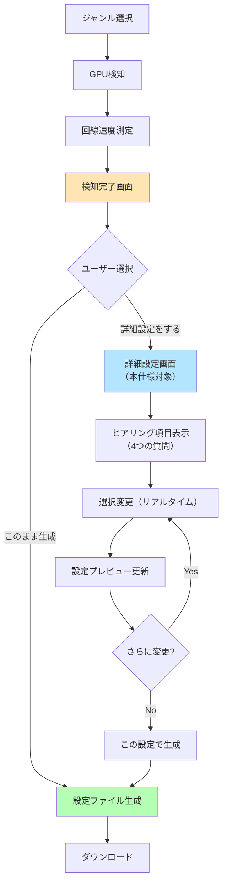

# 詳細設定フェーズ 設計書
**Project:** オートOBS設定
**Version:** 1.0.0
**Created:** 2026-02-12
**Phase:** 5.5
**Purpose:** 初級者向けヒアリング型カスタマイズUI

---

## 1. 概要

### 1.1 目的

自動設定では満足できないユーザー向けに、**専門用語を使わずに配信スタイルをヒアリング**し、その回答から最適な設定値を自動計算する。

**ターゲットユーザー:**
- 配信に慣れてきて「もう少し調整したい」と思っている初級〜中級者
- 技術用語（ビットレート、エンコーダプリセット等）は分からないが、配信の方向性は持っている人

**非ターゲット:**
- 完全な初心者 → 自動設定で十分
- 上級者 → OBS直接編集で対応可能

---

## 2. 画面フロー

### 2.1 全体フロー



### 2.2 画面遷移詳細

**Step 1: 検知完了画面（既存）**
```
┌─────────────────────────────────────┐
│ ✅ 検知完了！                        │
│                                     │
│ GPU: RTX 4070                       │
│ 回線: 15.2 Mbps                     │
│ 推奨: 60FPS / 9000kbps              │
│                                     │
│  [このまま生成する]  ← デフォルト    │
│  [詳細設定をする]    ← NEW!         │
└─────────────────────────────────────┘
```

**Step 2: 詳細設定画面（NEW）**
```
┌──────────────────────────────────────────────────────────┐
│  ⚙️ 配信スタイルをカスタマイズ                             │
│  自動設定から微調整したい方向けの詳細設定です               │
├──────────────────────────────────────────────────────────┤
│  ┌────────────────────┬─────────────────────────────┐  │
│  │ 📋 質問（4項目）    │ 📊 現在の設定プレビュー     │  │
│  │                    │                              │  │
│  │ Q1. 視聴者の端末    │ 解像度: 1080p 60fps         │  │
│  │ ○ スマホ中心        │ ビットレート: 8500 kbps     │  │
│  │ ● PC中心           │ エンコーダ: NVENC (p5)      │  │
│  │ ○ 半々              │ 画質: 高画質                 │  │
│  │                    │ 安定性: 高                  │  │
│  │ ──────────────      │                              │  │
│  │ Q2. 配信時間        │ 💡 選択を変更すると         │  │
│  │ ○ 短時間(1h以内)    │    設定が自動更新されます    │  │
│  │ ● 中時間(1-3h)      │                              │  │
│  │ ○ 長時間(3h以上)    └─────────────────────────────┘  │
│  │                                                      │  │
│  │ ──────────────                                       │  │
│  │ Q3. ネット接続                                       │  │
│  │ ● 有線(LAN)                                          │  │
│  │ ○ 無線(Wi-Fi)                                        │  │
│  │                                                      │  │
│  │ ──────────────                                       │  │
│  │ Q4. 録画の有無                                       │  │
│  │ ○ する                                               │  │
│  │ ● しない                                             │  │
│  └────────────────────                                  │  │
│                                                          │
│  ┌────────────────────────────────────────────────┐     │
│  │ 🎯 この設定で配信すると...                     │     │
│  │                                                │     │
│  │ ✅ PC視聴者に高画質で届きます                  │     │
│  │ ✅ 1-3時間の配信に最適化されています            │     │
│  │ ✅ 有線接続で安定した配信ができます             │     │
│  └────────────────────────────────────────────────┘     │
│                                                          │
│            [元の自動設定に戻す]  [この設定で生成]         │
└──────────────────────────────────────────────────────────┘
```

---

## 3. ヒアリング項目仕様

### 3.1 質問一覧

| ID | 質問文 | 選択肢 | デフォルト値 | 影響する設定値 |
|----|-------|-------|------------|--------------|
| Q1 | 配信中のPCパフォーマンスは、どちらを優先しますか？ | ゲームの快適さ / 配信画質 / バランス | バランス | エンコーダプリセット |
| Q2 | 配信画面に、あなた自身はどのように登場しますか？ | Webカメラ / アバター / 声のみ | 声のみ | OBSシーン構成、ガイド内容 |
| Q3 | マイクの音声について、何か気になることはありますか？（複数選択可） | 声の大きさ / 周囲のノイズ / 特になし | 特になし | OBS音声フィルタ、ガイド内容 |

### 3.2 選択肢詳細仕様

#### Q1: PCパフォーマンス vs 配信画質

```typescript
interface PerformancePriorityOption {
  id: 'performance' | 'quality' | 'balanced';
  label: string;
  description: string;
  effects: {
    presetAdjustment: -1 | 0 | 1; // -1=軽量化(速度優先), 0=維持, 1=高画質化
  };
}

const PERFORMANCE_PRIORITY_OPTIONS: PerformancePriorityOption[] = [
  {
    id: 'performance',
    label: 'ゲームをサクサク快適にプレイしたい',
    description: 'PCへの負荷を最も軽くする設定を優先します。',
    effects: {
      presetAdjustment: -1, // 軽量化
    },
  },
  {
    id: 'quality',
    label: '視聴者に少しでも綺麗な映像を届けたい',
    description: 'PCへの負荷は少し上がりますが、配信の画質を優先します。',
    effects: {
      presetAdjustment: 1, // 高画質化
    },
  },
  {
    id: 'balanced',
    label: 'おまかせ（推奨）',
    description: 'ゲームの快適さと配信画質を両立する、バランスの取れた設定です。',
    effects: {
      presetAdjustment: 0, // 維持
    },
  },
];
```

#### Q2: 配信でのあなたの見せ方

```typescript
interface PersonaOption {
  id: 'camera' | 'avatar' | 'voice_only';
  label: string;
  description: string;
  effects: {
    guideSuggestions: Array<'add_camera_source' | 'setup_vtuber_capture'>;
  };
}

const PERSONA_OPTIONS: PersonaOption[] = [
  {
    id: 'camera',
    label: 'Webカメラで自分を映す（顔出し）',
    description: 'ゲーム画面の隅にあなたの映像を表示します。',
    effects: {
      guideSuggestions: ['add_camera_source'],
    },
  },
  {
    id: 'avatar',
    label: 'アバターやキャラクターを代わりに表示する（VTuberなど）',
    description: 'VTube Studioなどのアプリと連携する場合に選びます。',
    effects: {
      guideSuggestions: ['setup_vtuber_capture'],
    },
  },
  {
    id: 'voice_only',
    label: '声だけで、画面には登場しない',
    description: 'ゲーム画面のみを配信します。最もシンプルな構成です。',
    effects: {
      guideSuggestions: [],
    },
  },
];
```

#### Q3: マイク音声の悩み（複数選択）

```typescript
interface AudioConcernOption {
  id: 'volume' | 'noise';
  label: string;
  description: string;
  effects: {
    guideSuggestions: Array<'add_compressor_filter' | 'add_noise_gate_filter' | 'add_noise_suppression_filter'>;
  };
}

const AUDIO_CONCERN_OPTIONS: AudioConcernOption[] = [
  {
    id: 'volume',
    label: '自分の声が小さすぎたり、大きすぎたりしないか心配',
    description: '声量を自動で一定に保つフィルタの設定をガイドに追加します。',
    effects: {
      guideSuggestions: ['add_compressor_filter'],
    },
  },
  {
    id: 'noise',
    label: 'キーボードの音や、周りの生活音が入らないか心配',
    description: '不要なノイズや環境音だけを消すフィルタの設定をガイドに追加します。',
    effects: {
      guideSuggestions: ['add_noise_suppression_filter', 'add_noise_gate_filter'],
    },
  },
];
```

---

## 4. 設定計算ロジック（改訂案）

### 4.1 計算フロー

```typescript
/**
 * ヒアリング結果から最終設定を計算
 */
function calculateAdvancedSettings(
  baseConfig: ObsConfig,
  answers: AdvancedSettingsAnswers
): { config: ObsConfig, guideUpdates: GuideUpdate[] } {
  let config = { ...baseConfig };
  const guideUpdates: GuideUpdate[] = [];

  // 1. エンコーダプリセット調整（Q1の影響）
  const perfChoice = PERFORMANCE_PRIORITY_OPTIONS.find(opt => opt.id === answers.performancePriority)!;
  config.preset = adjustPreset(
    baseConfig.preset,
    baseConfig.encoder,
    perfChoice.effects.presetAdjustment
  );

  // 2. ガイド内容の更新（Q2の影響）
  const personaChoice = PERSONA_OPTIONS.find(opt => opt.id === answers.persona)!;
  guideUpdates.push(...personaChoice.effects.guideSuggestions);

  // 3. ガイド内容の更新（Q3の影響）
  if (answers.audioConcerns.includes('volume')) {
      const volumeChoice = AUDIO_CONCERN_OPTIONS.find(opt => opt.id === 'volume')!;
      guideUpdates.push(...volumeChoice.effects.guideSuggestions);
  }
  if (answers.audioConcerns.includes('noise')) {
      const noiseChoice = AUDIO_CONCERN_OPTIONS.find(opt => opt.id === 'noise')!;
      guideUpdates.push(...noiseChoice.effects.guideSuggestions);
  }

  return { config, guideUpdates };
}
```
（以降の古い仕様は削除）
